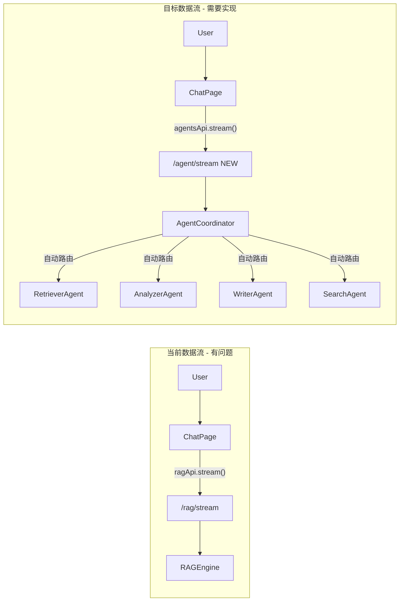

# Agent 调度系统集成与项目完善方案

## 一、当前项目真实状况

### 已完成且可用的部分

- 后端 Agent 系统完整：4 个 Agent (Retriever/Analyzer/Writer/Search) + Coordinator + Skills 注册表
- LLM 已配置：`deepseek/deepseek-chat-v3-0324:free` via OpenRouter（未微调大模型，符合需求）
- 前端服务层完整：`agents.ts` / `rag.ts` / `trends.ts` / `writing.ts` 等全部写好
- RAG 流式问答 (`/rag/stream`) 端到端可用
- 可视化模块 (ECharts) 已对接趋势分析 API

### 核心断层问题




**问题 1：Chat 页面绕过了"大脑"**

- `[frontend/src/pages/Chat/index.tsx](frontend/src/pages/Chat/index.tsx)` 第 119 行直接调用 `ragApi.stream()`
- Agent Coordinator 从未被前端 Chat 使用

**问题 2：Agent API 不支持流式响应**

- `[backend/app/api/v1/agents.py](backend/app/api/v1/agents.py)` 的 `agent_ask` (第 66-94 行) 返回 JSON
- 前端 Chat 组件依赖 SSE 流式输出，无法直接对接

**问题 3：前端 Agent 服务缺少流式方法**

- `[frontend/src/services/agents.ts](frontend/src/services/agents.ts)` 只有 `ask()` (axios POST)，没有 `stream()` (fetch SSE)

## 二、具体修改方案

### 步骤 1：后端新增 Agent 流式端点

在 `[backend/app/api/v1/agents.py](backend/app/api/v1/agents.py)` 中新增 `POST /agent/stream`：

```python
@router.post("/stream")
async def agent_stream(request: AgentRequest, ...):
    async def generate():
        # 1. 先让 Coordinator 路由到合适的 Agent
        # 2. 对于 RetrieverAgent，复用 RAG 的流式逻辑
        # 3. 对于其他 Agent，先执行获取结果，再逐块发送
        # 4. 发送 agent_type / metadata 等附加信息
    return StreamingResponse(generate(), media_type="text/event-stream")
```

关键设计：

- SSE 事件类型：`routing` (告知用户路由到了哪个 Agent) -> `chunk` (逐字输出) -> `references` (引用) -> `metadata` (Agent 元数据，如图表数据) -> `done`
- 对于 RetrieverAgent：直接复用 `rag_engine.llm.astream()` 的流式输出
- 对于 Analyzer/Writer/Search Agent：先执行 `agent.execute()`，再将结果拆分成 chunk 发送

### 步骤 2：前端 Agent 服务新增流式方法

在 `[frontend/src/services/agents.ts](frontend/src/services/agents.ts)` 中新增 `stream()` 方法，参考 `[frontend/src/services/rag.ts](frontend/src/services/rag.ts)` 的实现（fetch + ReadableStream）：

```typescript
export interface AgentStreamCallbacks {
    onRouting: (agentType: string) => void;
    onChunk: (chunk: string) => void;
    onReferences: (refs: Reference[]) => void;
    onMetadata: (metadata: Record<string, any>) => void;
    onDone: (answer: string) => void;
    onError: (error: string) => void;
}

stream: async (data: AgentRequest, callbacks: AgentStreamCallbacks) => {
    // 使用 fetch API + SSE 解析
}
```

### 步骤 3：前端 Chat 页面切换到 Agent 流式接口

修改 `[frontend/src/pages/Chat/index.tsx](frontend/src/pages/Chat/index.tsx)`：

- 将第 119 行的 `ragApi.stream()` 替换为 `agentsApi.stream()`
- 新增 `onRouting` 回调：在消息中显示 "正在通过 [分析Agent] 处理..."
- 新增 `onMetadata` 回调：当 Agent 返回图表数据时，渲染对应的可视化组件
- 调整请求参数格式：从 `{ question, project_id, top_k }` 改为 `{ query, project_id }`

### 步骤 4：确保服务可用性（降级策略）

当前后端启动需要 PostgreSQL + MongoDB + Redis + Milvus 全部在线。需要确保：

- RAG Engine 初始化失败时仍可启动（已有 MockEmbedder 降级）
- Agent Coordinator 在 RAG 不可用时仍能处理请求（Writer/Search Agent 不依赖 RAG）
- 流式端点在 LLM 不可用时返回明确错误而非挂起

### 步骤 5：对话持久化适配

当前 `/rag/stream` 不保存对话到数据库（只有 `/rag/ask` 才保存）。新的 `/agent/stream` 需要在流式完成后保存对话记录：

- 在 `done` 事件发送前，将完整对话写入 `Conversation` 表
- 同时记录使用的 Agent 类型到对话元数据中

## 三、不需要修改的部分

- LLM 配置：当前 `deepseek/deepseek-chat-v3-0324:free` 已经是未微调模型，符合要求
- Agent 路由逻辑：`coordinator._route_query()` 基于关键词匹配，已可用
- 4 个 Agent 的 `execute()` 方法：逻辑完整，无需修改
- 可视化页面：已独立对接趋势 API，无需改动
- 写作辅助页面：已独立对接 Writing API，无需改动

