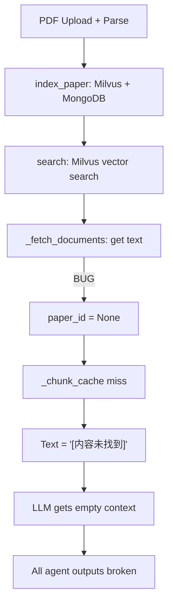

# Fix Agent Skills and Document Retrieval Pipeline

## Problem Diagnosis

Through deep code analysis, I identified **6 root causes** for the failures seen in the screenshots (empty references, 1-node knowledge graph, generic literature review):




### Root Cause 1 (CRITICAL): Milvus search result field access pattern wrong in `engine.py`

With pymilvus 2.3.5, `MilvusClient.search()` returns results in nested format:

```python
{"id": "9_0", "distance": 0.85, "entity": {"paper_id": 9, "chunk_index": 0}}
```

But `[engine.py` line 382-383](backend/app/rag/engine.py) accesses fields directly:

```python
paper_id = result.get("paper_id")       # Returns None!
chunk_index = result.get("chunk_index") # Returns None!
```

The correct pattern (already used in `[dynamic_memory.py` line 239](backend/app/rag/memory_engine/dynamic_memory.py) and `[retriever.py` lines 114-118](backend/app/rag/retriever.py)):

```python
entity = hit.get("entity", {})
paper_id = entity.get("paper_id")
```

**This single bug breaks ALL document text retrieval** -- causing "[内容未找到]" in RAG answers, empty writer references, and empty KG input.

### Root Cause 2: Knowledge graph endpoint text retrieval is dead code

In `[agents.py` lines 485-493](backend/app/api/v1/agents.py):

- `hasattr(rag_engine, '_mongodb')` is **always False** -- `RAGEngine` has no `_mongodb` attribute
- `mongodb_service.get_project_chunks()` **does not exist** (only `get_chunks(paper_id)` exists)
- The fallback uses a hardcoded English query `"research methodology findings"`

### Root Cause 3: AnalyzerAgent uses query string as KG text

In `[analyzer_agent.py` line 110](backend/app/agents/analyzer_agent.py):

```python
text = kwargs.get("text", query)  # Defaults to "构建知识图谱"
```

When called via `/agent/stream`, no `text` kwarg is provided, so the KG skill receives the literal user query as input text instead of actual paper content.

### Root Cause 4: `langchain_experimental` not installed

Terminal logs confirm:

```
LLMGraphTransformer not available: No module named 'langchain_experimental'
```

KG always falls back to naive regex co-occurrence, producing poor results even with good text input.

### Root Cause 5: Writer agent gets empty document content

Due to Root Cause 1, `_generate_outline()` and `_generate_review()` in `[writer_agent.py](backend/app/agents/writer_agent.py)` receive documents with text = "[内容未找到]", so the LLM generates generic content.

### Root Cause 6: Stream endpoint has duplicated broken logic

The `/stream` endpoint in `[agents.py` lines 176-186](backend/app/api/v1/agents.py) has its own document retrieval flow that also calls `_fetch_documents()` with the same bug.

---

## Fix Plan

### Fix 1: Correct Milvus result field access in `_fetch_documents()`

**File:** `[backend/app/rag/engine.py](backend/app/rag/engine.py)` lines 373-405

Change `_fetch_documents()` to properly extract fields from Milvus result's `entity` dict. Also add a compatibility layer that handles both nested and flat formats:

```python
async def _fetch_documents(self, search_results):
    from app.services.mongodb_service import mongodb_service
    docs = []
    for result in search_results:
        # pymilvus 2.3.x: fields under "entity" key
        entity = result.get("entity", result)
        paper_id = entity.get("paper_id")
        chunk_index = entity.get("chunk_index")
        # ... rest of logic
```

### Fix 2: Add `get_project_chunks()` to MongoDB service

**File:** `[backend/app/services/mongodb_service.py](backend/app/services/mongodb_service.py)`

Add a new method to retrieve chunks by `project_id`:

```python
async def get_project_chunks(self, project_id: int, limit: int = 50):
    # Query paper_chunks where paper_id is in the project's papers
    # Fallback: iterate _fallback_store for matching project papers
```

Since MongoDB's `paper_chunks` collection doesn't store `project_id` directly, we need to:

1. Query PostgreSQL for paper IDs in the project
2. Query MongoDB for chunks from those papers

Alternatively, pass paper IDs from the caller.

### Fix 3: Fix knowledge graph endpoint to properly fetch project text

**File:** `[backend/app/api/v1/agents.py](backend/app/api/v1/agents.py)` lines 482-514

Replace the broken text retrieval logic:

1. Query `Paper` table for all papers in the project
2. For each paper, get chunks from MongoDB (or cache/fallback)
3. Combine text and pass to `build_knowledge_graph` skill

```python
# Get papers for this project from PostgreSQL
from app.models.paper import Paper
papers_result = await db.execute(
    select(Paper).where(Paper.project_id == request.project_id)
)
papers = papers_result.scalars().all()

# Collect text from MongoDB chunks
from app.services.mongodb_service import mongodb_service
text_parts = []
for paper in papers:
    chunks = await mongodb_service.get_chunks(paper.id)
    for chunk in chunks[:10]:  # limit per paper
        text_parts.append(chunk.get("text", ""))
```

### Fix 4: Fix AnalyzerAgent to fetch real document content for KG

**File:** `[backend/app/agents/analyzer_agent.py](backend/app/agents/analyzer_agent.py)` lines 108-117

When `analysis_type == "knowledge_graph"`, fetch project documents via RAG engine instead of using the query string:

```python
if any(kw in query_lower for kw in self.KG_KEYWORDS):
    # Fetch actual project text instead of using query
    text = kwargs.get("text", "")
    if not text and hasattr(self, '_rag_engine') or kwargs.get("project_id"):
        # Retrieve project documents
        ...
    kg_result = await self._execute_skill("build_knowledge_graph", text=text)
```

Also inject `rag_engine` into `AnalyzerAgent` so it can fetch documents.

### Fix 5: Install `langchain_experimental` and fix KG skill

**File:** `[backend/requirements.txt](backend/requirements.txt)`

Add: `langchain-experimental>=0.0.47`

Also improve the fallback KG method in `[analysis_skills.py](backend/app/skills/analysis/analysis_skills.py)` to use LLM-based entity extraction via the already-available OpenRouter LLM, instead of regex:

```python
async def _build_kg_fallback(text, max_entities=30):
    # Use LLM to extract entities and relations
    from app.core.config import settings
    from langchain_openai import ChatOpenAI
    llm = ChatOpenAI(...)
    prompt = "Extract entities and relationships from this text..."
    # Parse structured response
```

### Fix 6: Add RAG engine reference to AnalyzerAgent

**File:** `[backend/app/agents/coordinator.py](backend/app/agents/coordinator.py)`

Pass `rag_engine` to `AnalyzerAgent` during initialization, similar to how it's done for `RetrieverAgent` and `WriterAgent`:

```python
analyzer = AnalyzerAgent(rag_engine=self._rag_engine)
```

**File:** `[backend/app/agents/analyzer_agent.py](backend/app/agents/analyzer_agent.py)`

Add `rag_engine` parameter to constructor and use it to fetch document content.

---

## Impact Summary


| Fix   | Affects                    | Severity |
| ----- | -------------------------- | -------- |
| Fix 1 | ALL RAG-dependent features | Critical |
| Fix 2 | Knowledge graph endpoint   | High     |
| Fix 3 | Knowledge graph endpoint   | High     |
| Fix 4 | Knowledge graph via chat   | High     |
| Fix 5 | Knowledge graph quality    | Medium   |
| Fix 6 | Analyzer agent             | Medium   |


