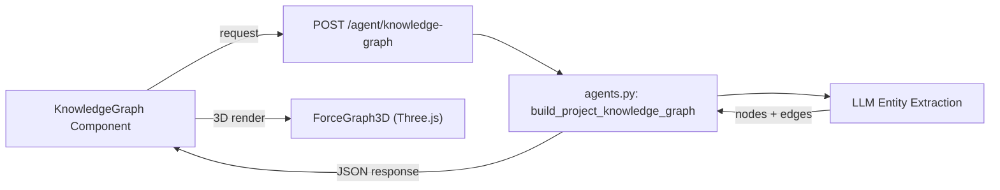

# Fix Memory Stats "未连接" + 3D Knowledge Graph

## Issue 1: 记忆总量显示"未连接"

### Root Cause

Terminal log clearly shows the error:

```
ERROR | app.rag.memory_engine.dynamic_memory:get_stats:491 - Get stats failed: 'MilvusClient' object has no attribute 'get_collection_stats'
```

In [backend/app/rag/memory_engine/dynamic_memory.py](backend/app/rag/memory_engine/dynamic_memory.py) line 455, the `get_stats` method calls `self.milvus.get_collection_stats()`, but the installed pymilvus 2.3.5 的 MilvusClient 对象没有该方法（文档虽标注 2.3.x 支持，但实际 2.3.5 版本缺失此方法）。

异常被 `except` 捕获后返回 `{"status": "error", "message": "..."}`, 前端在 [frontend/src/pages/Project/MemoryDashboard/index.tsx](frontend/src/pages/Project/MemoryDashboard/index.tsx) line 93 检查 `engine.status === 'connected'` 失败，因此显示红色 "未连接" 标签。

### Fix

修改 `get_stats` 方法，使用 query-based 计数代替 `get_collection_stats`（项目中已有此模式在 `list_memories` 方法中使用）:

```python
async def get_stats(self) -> Dict[str, Any]:
    if not self.milvus:
        return {"status": "disconnected"}
    
    try:
        type_breakdown = {}
        agent_breakdown = {}
        row_count = 0
        
        try:
            all_items = self.milvus.query(
                collection_name=self.COLLECTION_NAME,
                filter="",
                output_fields=["memory_type", "agent_source"],
                limit=10000
            )
            row_count = len(all_items or [])
            for item in (all_items or []):
                mt = str(item.get("memory_type", "unknown"))
                ag = str(item.get("agent_source", "unknown"))
                type_breakdown[mt] = type_breakdown.get(mt, 0) + 1
                agent_breakdown[ag] = agent_breakdown.get(ag, 0) + 1
        except Exception:
            pass
        
        return {
            "status": "connected",
            "collection": self.COLLECTION_NAME,
            "row_count": row_count,
            "type_breakdown": type_breakdown,
            "agent_breakdown": agent_breakdown,
        }
    except Exception as e:
        logger.error(f"Get stats failed: {e}")
        return {"status": "error", "message": str(e)}
```

要点：移除 `get_collection_stats` 调用，改为直接使用已验证可用的 `query` 方法来获取记录数和分类统计，一次查询完成所有统计。

---

## Issue 2: 知识图谱升级为 3D

### Current State

当前使用 @antv/g6 v5 进行 2D Canvas 渲染（force-directed layout），位于 [frontend/src/pages/Project/KnowledgeGraph/index.tsx](frontend/src/pages/Project/KnowledgeGraph/index.tsx)。

### Approach: 使用 react-force-graph-3d

选择 `react-force-graph-3d` 库（基于 Three.js + WebGL，npm 周下载量 ~56k，MIT 协议），提供：

- 3D 力导向布局（d3-force-3d）
- WebGL 高性能渲染
- 内置交互：旋转、缩放、拖拽节点
- TypeScript 支持

### Implementation

**Step 1: 安装依赖**

```bash
npm install react-force-graph-3d
```

**Step 2: 改造 KnowledgeGraph 组件**

将 [frontend/src/pages/Project/KnowledgeGraph/index.tsx](frontend/src/pages/Project/KnowledgeGraph/index.tsx) 改为 2D/3D 双模式：

- 添加 2D/3D 切换按钮（Segmented 组件）
- 3D 模式使用 `react-force-graph-3d` 的 `ForceGraph3D` 组件
- 2D 模式保留原有 G6 实现作为备选
- 节点颜色映射保持不变（按 type 着色）
- 3D 模式下节点使用球体，hover 显示完整标题
- 边关系标签以 3D sprite 形式显示

核心 3D 渲染代码结构：

```tsx
import ForceGraph3D from 'react-force-graph-3d';

// In content mode:
<ForceGraph3D
  graphData={{
    nodes: graphData.nodes.map(n => ({
      id: n.id,
      name: n.title || n.id,
      type: n.type,
      color: contentColors[n.type] || '#999',
    })),
    links: graphData.edges.map(e => ({
      source: e.source,
      target: e.target,
      label: e.relation,
    })),
  }}
  nodeLabel="name"
  nodeColor="color"
  nodeRelSize={6}
  linkDirectionalArrowLength={3.5}
  linkLabel="label"
  width={containerWidth}
  height={500}
  backgroundColor="#1a1a2e"
/>
```

**Step 3: UI 增强**

- 默认展示 3D 模式（更具视觉冲击力）
- 深色背景 + 彩色节点（科技感）
- 节点大小可根据连接数（degree）动态调整
- 鼠标悬停高亮相邻节点和边

### Data flow (unchanged)




后端 API 和数据格式无需修改，仅前端渲染层升级。