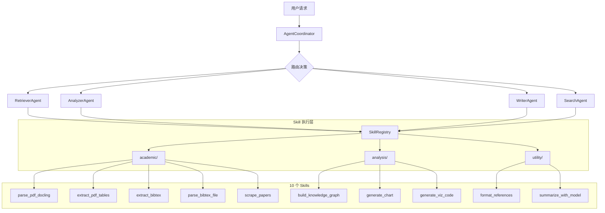
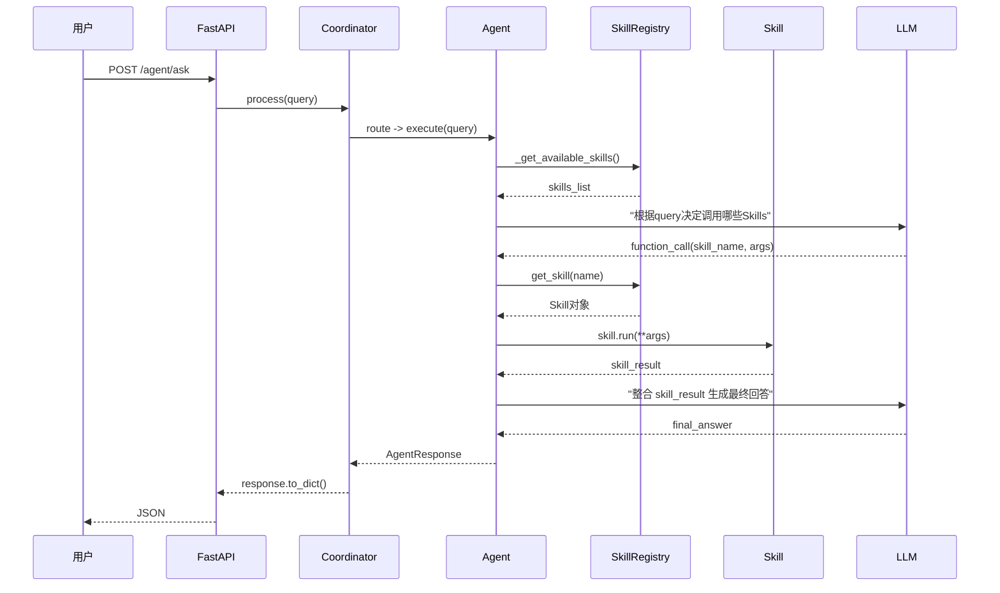

# Agent Skills 融入多智能体协作系统实施方案

## 现状分析

当前代码已有：

- [registry.py](backend/app/skills/registry.py): `SkillRegistry` + `Skill` 类，支持装饰器注册、输入验证、异步执行
- [academic_skills.py](backend/app/skills/academic/academic_skills.py): 3 个占位 Skill（`parse_pdf_with_docling`, `extract_bibtex_from_pdf`, `scrape_papers_online`），仅返回模拟数据
- [base_agent.py](backend/app/agents/base_agent.py): `BaseAgent` 无 Skills 感知能力
- [coordinator.py](backend/app/agents/coordinator.py): `AgentCoordinator` 未集成 Skills 注册表
- 缺少 `__init__.py` 文件，Skills 模块未被 import

**核心问题**: Skills 系统与 Agent 系统完全断开，Agent 执行逻辑全部硬编码。

---

## 整体架构设计




---

## 第一步: 增强 SkillRegistry

**文件**: [backend/app/skills/registry.py](backend/app/skills/registry.py)

改造要点:

- 新增 `to_openai_functions()` 方法：将注册的 Skills 转为 OpenAI Function Calling 格式（JSON Schema），供 LLM 选择调用
- 新增 `get_skills_by_category()` 方法：Agent 按需加载自己类别的 Skills，避免 System Prompt 上下文过长
- 新增 `get_skills_prompt()` 方法：生成供 LLM 理解的 Skills 描述文本
- `Skill.run()` 增加超时控制和沙箱化错误处理（单个 Skill 失败不影响 Agent）

核心新增代码示意:

```python
def to_openai_functions(self, category: Optional[str] = None) -> List[Dict]:
    """转换为 OpenAI Function Calling 格式"""
    functions = []
    for skill in self.skills.values():
        if category and skill.category != category:
            continue
        functions.append({
            "type": "function",
            "function": {
                "name": skill.name,
                "description": skill.description,
                "parameters": skill.input_schema.model_json_schema()
            }
        })
    return functions

def get_skills_prompt(self, category: Optional[str] = None) -> str:
    """生成 Skills 描述文本供 System Prompt 使用"""
    skills = self.list_skills(category)
    lines = ["你可以使用以下工具来完成任务："]
    for s in skills:
        params_desc = ", ".join(f"{k}: {v.get('type','')}" 
                                for k, v in s["parameters"].get("properties", {}).items())
        lines.append(f"- {s['name']}: {s['description']} 参数({params_desc})")
    return "\n".join(lines)
```

---

## 第二步: 改造 BaseAgent 支持 Skills

**文件**: [backend/app/agents/base_agent.py](backend/app/agents/base_agent.py)

改造要点:

- 新增 `_skill_categories: List[str]` 属性：声明该 Agent 关心的 Skill 类别
- 新增 `_get_available_skills()` 方法：从 `skill_registry` 获取本 Agent 可用的 Skills
- 新增 `_execute_skill(skill_name, **kwargs)` 方法：安全执行单个 Skill（含超时、错误捕获、日志）
- 新增 `_select_and_execute_skills(query)` 方法：通过 LLM Function Calling 或规则匹配自动选择并执行 Skills
- 在 `AgentResponse.metadata` 中记录 `skills_used` 字段

```python
class BaseAgent(ABC):
    agent_type: AgentType = AgentType.RETRIEVER
    description: str = "Base Agent"
    _skill_categories: List[str] = []  # 新增

    def __init__(self):
        self._memory_engine = None
        self._cross_memory = None
        self._llm = None
        self._skill_registry = None  # 新增

    def set_skill_registry(self, registry):
        """注入技能注册表"""
        self._skill_registry = registry

    def _get_available_skills(self) -> List[Dict]:
        """获取当前 Agent 可用的 Skills 列表"""
        if not self._skill_registry:
            return []
        skills = []
        for cat in self._skill_categories:
            skills.extend(self._skill_registry.list_skills(category=cat))
        return skills

    async def _execute_skill(self, skill_name: str, **kwargs) -> Any:
        """安全执行单个 Skill"""
        skill = self._skill_registry.get_skill(skill_name)
        if not skill:
            return {"error": f"Skill '{skill_name}' not found"}
        try:
            result = await asyncio.wait_for(skill.run(**kwargs), timeout=30.0)
            logger.info(f"Skill {skill_name} executed successfully")
            return result
        except asyncio.TimeoutError:
            return {"error": f"Skill '{skill_name}' timed out"}
        except Exception as e:
            return {"error": f"Skill '{skill_name}' failed: {str(e)}"}
```

---

## 第三步: 实现 10 个 Skills（按类别组织）

### 目录结构

```
backend/app/skills/
├── __init__.py           # 导入所有 skill 模块，触发注册
├── registry.py           # 增强版注册中心
├── academic/
│   ├── __init__.py
│   └── academic_skills.py  # 5 个学术 Skills（改写 + 新增）
├── analysis/
│   ├── __init__.py
│   └── analysis_skills.py  # 3 个分析 Skills
└── utility/
    ├── __init__.py
    └── utility_skills.py   # 2 个通用 Skills
```

### academic/ 类别 (5 Skills)

**文件**: [backend/app/skills/academic/academic_skills.py](backend/app/skills/academic/academic_skills.py)


| #   | Skill 名称             | 功能                    | 集成库          | 对应 Agent  |
| --- | -------------------- | --------------------- | ------------ | --------- |
| 1   | `parse_pdf_docling`  | 高精度 PDF 结构化解析         | docling      | Retriever |
| 2   | `extract_pdf_tables` | PDF 表格数据提取            | camelot      | Analyzer  |
| 3   | `extract_bibtex`     | PDF 提取 DOI 并获取 BibTeX | pdf2bib      | Writer    |
| 4   | `parse_bibtex_file`  | 解析 BibTeX 文件          | bibtexparser | Writer    |
| 5   | `scrape_papers`      | 在线论文抓取                | paperscraper | Search    |


实现示意 (extract_pdf_tables):

```python
class ExtractTableInput(BaseModel):
    file_path: str = Field(..., description="PDF文件路径")
    pages: str = Field(default="all", description="页码范围，如 '1,3-5' 或 'all'")

@skill_registry.register(
    name="extract_pdf_tables",
    description="从PDF中精确提取表格数据，返回结构化的表格信息（行/列/单元格）。",
    input_schema=ExtractTableInput,
    category="academic"
)
async def extract_pdf_tables(file_path: str, pages: str = "all"):
    import camelot
    tables = camelot.read_pdf(file_path, pages=pages, flavor='lattice')
    if not tables:
        tables = camelot.read_pdf(file_path, pages=pages, flavor='stream')
    results = []
    for i, table in enumerate(tables):
        results.append({
            "table_index": i,
            "rows": table.df.values.tolist(),
            "columns": table.df.columns.tolist(),
            "accuracy": table.accuracy
        })
    return {"tables": results, "count": len(results)}
```

### analysis/ 类别 (3 Skills)

**新建文件**: `backend/app/skills/analysis/analysis_skills.py`


| #   | Skill 名称                | 功能            | 集成库                           | 对应 Agent |
| --- | ----------------------- | ------------- | ----------------------------- | -------- |
| 6   | `build_knowledge_graph` | 从文本提取实体关系三元组  | LangChain LLMGraphTransformer | Analyzer |
| 7   | `generate_chart`        | 根据数据生成统计图表    | matplotlib + seaborn          | Analyzer |
| 8   | `generate_viz_code`     | 让 LLM 生成可视化代码 | LLM + matplotlib              | Analyzer |


### utility/ 类别 (2 Skills)

**新建文件**: `backend/app/skills/utility/utility_skills.py`


| #   | Skill 名称               | 功能           | 集成库          | 对应 Agent |
| --- | ---------------------- | ------------ | ------------ | -------- |
| 9   | `format_references`    | 格式化参考文献列表    | bibtexparser | Writer   |
| 10  | `summarize_with_model` | 使用指定模型进行文本摘要 | litellm      | 通用       |


---

## 第四步: 将 Skills 注入各 Agent

### RetrieverAgent

**文件**: [backend/app/agents/retriever_agent.py](backend/app/agents/retriever_agent.py)

- 设置 `_skill_categories = ["academic"]`
- 在 `execute()` 中：当用户上传了 PDF 需要解析时，调用 `parse_pdf_docling` Skill
- 将 RAG 检索结果与 Skill 执行结果融合

### AnalyzerAgent

**文件**: [backend/app/agents/analyzer_agent.py](backend/app/agents/analyzer_agent.py)

- 设置 `_skill_categories = ["academic", "analysis"]`
- 在 `_perform_analysis()` 中：涉及表格数据时调用 `extract_pdf_tables`，需要可视化时调用 `generate_chart`
- 知识图谱分析任务路由到 `build_knowledge_graph`

### WriterAgent

**文件**: [backend/app/agents/writer_agent.py](backend/app/agents/writer_agent.py)

- 设置 `_skill_categories = ["academic", "utility"]`
- 在 `_suggest_citations()` 中：调用 `extract_bibtex` 和 `format_references`
- 在 `_generate_review()` 中：先调用 `parse_bibtex_file` 获取文献结构化信息

### SearchAgent

**文件**: [backend/app/agents/search_agent.py](backend/app/agents/search_agent.py)

- 设置 `_skill_categories = ["academic"]`
- 在 `_search_papers()` 中：调用 `scrape_papers` Skill 作为外部 API 的补充来源

---

## 第五步: Coordinator 集成

**文件**: [backend/app/agents/coordinator.py](backend/app/agents/coordinator.py)

改造要点:

- 在 `_register_agents()` 中为每个 Agent 注入 `skill_registry`
- 新增 `list_available_skills()` 方法：提供 API 层查询可用 Skills
- 在 Agent 初始化时自动导入 Skills 模块触发注册

```python
from app.skills import skill_registry  # 触发所有 skill 注册

def _register_agents(self):
    retriever = RetrieverAgent(rag_engine=self._rag_engine)
    retriever.set_skill_registry(skill_registry)  # 新增
    # ... 其他设置 ...
```

---

## 第六步: API 层扩展

**文件**: [backend/app/api/v1/agents.py](backend/app/api/v1/agents.py)

新增两个端点:

```python
@router.get("/skills")
async def list_skills(category: Optional[str] = None):
    """列出所有可用的 Agent Skills"""

@router.post("/skills/execute")
async def execute_skill(request: SkillExecuteRequest):
    """直接执行指定 Skill（调试/高级用户）"""
```

---

## 第七步: Skills `__init__.py` 模块初始化

**新建文件**: `backend/app/skills/__init__.py`

```python
"""Skills 模块 - 自动注册所有技能"""
from app.skills.registry import skill_registry

# 导入各分类技能模块，触发 @skill_registry.register 装饰器
import app.skills.academic.academic_skills
import app.skills.analysis.analysis_skills
import app.skills.utility.utility_skills

__all__ = ["skill_registry"]
```

---

## 数据流示意




---

## 依赖确认

[requirements.txt](backend/requirements.txt) 已包含所需库（第 69-78 行），无需新增依赖:

- docling, camelot-py, pdf2bib, bibtexparser, paperscraper
- litellm, matplotlib, seaborn, networkx

