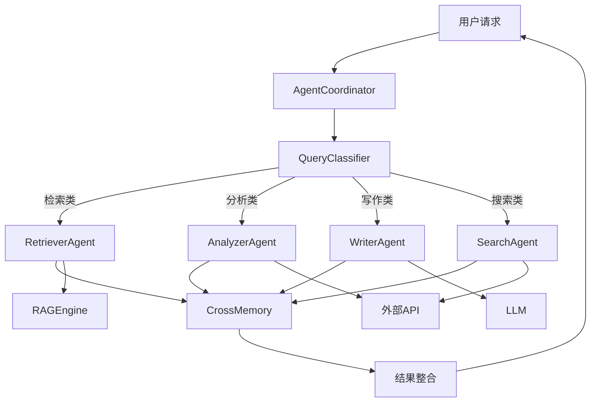
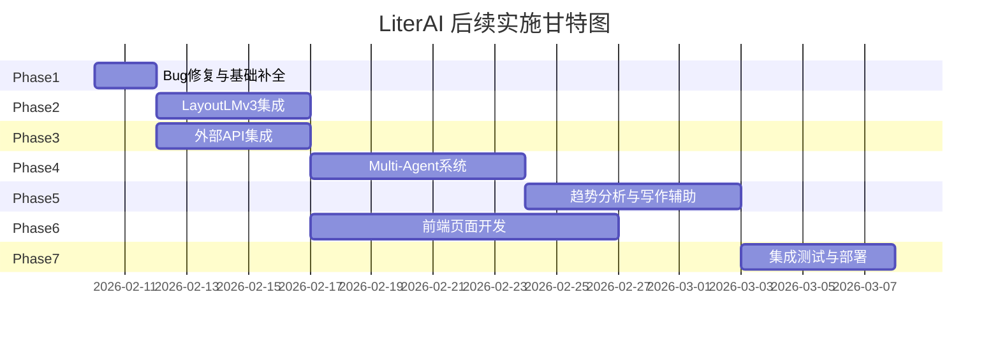

# LiterAI 文献分析平台 -- 后续实现方案

## 当前完成情况总览


| 模块  | 完成度 | 说明  |
| --- | --- | --- |


**已完成 (100%)**: 后端核心架构 (FastAPI/JWT/CRUD), RAG引擎 (BGE-M3/Milvus/混合检索), Agent记忆系统 (动态/交叉/重构/反思/遗忘), PDF基础解析 (PDFPlumber/OCR/元数据), 前端基础页面 (登录/仪表盘/项目列表/聊天), Docker基础设施

**部分完成 (60-80%)**: 前端页面 (缺项目详情/可视化/知识图谱/趋势/写作), PDF解析 (LayoutLMv3未集成), 测试 (仅记忆引擎单元测试)

**未实现 (0%)**: Multi-Agent系统, 外部API集成, 趋势分析服务, 写作辅助服务, 前端可视化/图谱/趋势/写作页面

---

## 实施方案 (共7个阶段, 按优先级排序)

---

### 阶段一: Bug修复与基础补全 (1-2天)

**1. 修复 auth.py 的 get_current_user 端点**

文件: [backend/app/api/v1/auth.py](backend/app/api/v1/auth.py)

当前代码 (约175行) 有一个 TODO:

```python
current_user: User = Depends(lambda: None)  # TODO: 替换为get_current_user
```

修复: 从 `app.core.deps` 导入 `get_current_user` 并替换占位符。

**2. Dashboard 对话数硬编码为0**

文件: [frontend/src/pages/Dashboard/index.tsx](frontend/src/pages/Dashboard/index.tsx)

约75行 `value={0}` 需要替换为实际API调用获取对话数。

---

### 阶段二: LayoutLMv3 集成到 PDF 解析流水线 (3-5天)

**目标**: 在现有 `PDFParser` 的 Layer 2 (OCR) 和 Layer 3 (元数据提取) 之间插入 LayoutLMv3 布局分析层。

**文件**: [backend/app/services/pdf_parser.py](backend/app/services/pdf_parser.py)

**实现方案**:

1. 创建 `backend/app/services/layout_analyzer.py` -- LayoutLMv3 布局分析器
  - 加载 `/Volumes/Samsung1T/Graduation_design/layoutlmv3-base/` 本地模型
  - 使用 `transformers.LayoutLMv3ForTokenClassification` 进行布局分析
  - 将 PDF 页面转为图像, 进行 Token 分类 (标题/段落/表格/公式/图注)
  - 输出结构化布局信息: `List[LayoutRegion]` (type, bbox, text, confidence)
2. 在 `pdf_parser.py` 的 `PDFParser.parse()` 中集成:
  - 在 OCR 之后、元数据提取之前调用 `LayoutAnalyzer`
  - 利用布局信息增强 section 检测和结构化提取
  - 将布局数据写入 `PDFPage.layout` 字段
3. 依赖: 需要在 `requirements.txt` 添加:
  - `Pillow` (PDF页面转图像)
  - `pdf2image` (PDF渲染)
  - 确认 `transformers` 已支持 LayoutLMv3

**关键接口设计**:

```python
class LayoutAnalyzer:
    def __init__(self, model_path: str = "layoutlmv3-base/"):
        ...
    async def analyze_page(self, image: Image, words: List[str], boxes: List[List[int]]) -> List[LayoutRegion]:
        ...
```

---

### 阶段三: 外部学术API集成 (3-5天)

**目标**: 集成 Semantic Scholar, OpenAlex, arXiv, CrossRef 四个外部API。

**新建文件**:

- `backend/app/services/external_apis/` 目录:
  - `__init__.py`
  - `semantic_scholar.py` -- Semantic Scholar API (论文搜索/引用网络/作者信息)
  - `openalex.py` -- OpenAlex API (开放学术数据/机构/概念)
  - `arxiv_client.py` -- arXiv API (预印本搜索/下载)
  - `crossref.py` -- CrossRef API (DOI解析/引用元数据)
  - `base.py` -- 公共基类 (限流/重试/缓存)
- `backend/app/api/v1/external.py` -- 外部API路由

**核心功能**:

- 论文搜索 (跨源聚合)
- 引用网络获取 (Semantic Scholar)
- 论文元数据补全 (CrossRef DOI解析)
- 相关论文推荐
- 作者信息和合作网络

**关键接口**:

```python
class SemanticScholarClient:
    async def search_papers(self, query: str, limit: int = 10) -> List[Paper]
    async def get_paper(self, paper_id: str) -> PaperDetail
    async def get_citations(self, paper_id: str) -> List[Citation]
    async def get_references(self, paper_id: str) -> List[Reference]

class OpenAlexClient:
    async def search_works(self, query: str) -> List[Work]
    async def get_concepts(self, work_id: str) -> List[Concept]
    async def get_trending_topics(self, field: str) -> List[Topic]
```

**API端点**:

- `GET /api/v1/external/search` -- 跨源论文搜索
- `GET /api/v1/external/paper/{id}` -- 论文详情(含引用)
- `GET /api/v1/external/citations/{id}` -- 引用网络
- `GET /api/v1/external/recommendations` -- 相关推荐

---

### 阶段四: Multi-Agent 系统 (5-7天)

**目标**: 实现 4 个专业 Agent + 1 个协调器, 基于 LangChain/LangGraph。

**新建文件**: `backend/app/agents/` 目录:

- `__init__.py`
- `coordinator.py` -- AgentCoordinator (任务路由/结果整合)
- `retriever_agent.py` -- 检索Agent (文献检索+RAG问答)
- `analyzer_agent.py` -- 分析Agent (趋势分析+统计)
- `writer_agent.py` -- 写作Agent (大纲生成+文献综述)
- `search_agent.py` -- 搜索Agent (外部API调用)
- `base_agent.py` -- Agent基类

**架构设计**:




**与现有代码集成**:

- `AgentCoordinator` 替代 [backend/app/rag/engine.py](backend/app/rag/engine.py) 中直接的 `answer()` 调用
- 利用已有的 `CrossMemoryNetwork` ([backend/app/rag/memory_engine/cross_memory.py](backend/app/rag/memory_engine/cross_memory.py)) 实现 Agent 间记忆共享
- 利用已有的 `QueryClassifier` ([backend/app/rag/memory_engine/query_classifier.py](backend/app/rag/memory_engine/query_classifier.py)) 进行快慢思考分流
- 在 [backend/app/api/v1/rag.py](backend/app/api/v1/rag.py) 中添加 agent 路由端点

**API端点**:

- `POST /api/v1/agent/ask` -- Agent协调问答
- `POST /api/v1/agent/analyze` -- 分析Agent直接调用
- `POST /api/v1/agent/write` -- 写作Agent直接调用
- `POST /api/v1/agent/search` -- 搜索Agent直接调用

---

### 阶段五: 趋势分析与写作辅助服务 (5-7天)

**5a. 趋势分析服务**

**新建文件**: `backend/app/services/trend_analyzer.py`

**功能**:

- 关键词频率统计 (基于已解析论文)
- 研究热点识别 (TF-IDF / BM25 scoring)
- 时间趋势分析 (按年份统计关键词分布)
- 突现词检测 (Kleinberg burst detection 简化实现)
- 领域分布分析 (基于外部API的概念标签)

**API端点** (`backend/app/api/v1/trends.py`):

- `GET /api/v1/trends/keywords` -- 关键词频率
- `GET /api/v1/trends/hotspots` -- 研究热点
- `GET /api/v1/trends/timeline` -- 时间趋势
- `GET /api/v1/trends/bursts` -- 突现词检测

**5b. 写作辅助服务**

**新建文件**: `backend/app/services/writing_assistant.py`

**功能**:

- 论文大纲生成 (基于主题+参考文献)
- 文献综述生成 (基于检索到的论文摘要)
- 段落润色 (学术写作风格)
- 引用建议 (基于RAG检索推荐引用)

**API端点** (`backend/app/api/v1/writing.py`):

- `POST /api/v1/writing/outline` -- 生成大纲
- `POST /api/v1/writing/review` -- 生成文献综述
- `POST /api/v1/writing/polish` -- 段落润色
- `POST /api/v1/writing/suggest-citations` -- 引用建议

---

### 阶段六: 前端页面开发 (7-10天)

**6a. 项目详情页** -- `frontend/src/pages/Project/Detail/index.tsx`

替换 [frontend/src/App.tsx](frontend/src/App.tsx) 中约34行的占位符。

实现:

- Tab 布局: 论文管理 | 可视化 | 知识图谱 | 趋势分析 | 写作辅助
- 论文列表 + 上传功能
- 论文详情抽屉 (标题/摘要/解析状态)

**6b. 可视化页面** -- `frontend/src/pages/Project/Visualization/index.tsx`

使用已安装的 `echarts-for-react` (v3.0.5):

- 词云图 (关键词频率)
- 发表趋势折线图 (按年份)
- 作者合作网络图
- 领域分布饼图/雷达图

**6c. 知识图谱页面** -- `frontend/src/pages/Project/KnowledgeGraph/index.tsx`

使用已安装的 `@antv/g6` (v5.0.51):

- 论文引用网络图
- 关键词关联图
- 交互操作: 缩放/拖拽/点击展开详情
- 节点搜索和过滤

**6d. 趋势分析页面** -- `frontend/src/pages/Project/TrendAnalysis/index.tsx`

使用 ECharts:

- 时间序列图 (研究热点演变)
- 突现词检测结果展示
- 领域对比分析

**6e. 写作辅助页面** -- `frontend/src/pages/Project/WritingAssistant/index.tsx`

- 左侧: 大纲编辑器 (可编辑树形结构)
- 右侧: 文献综述/段落生成区
- 底部: 引用建议面板
- 集成 Ant Design 的 `Input.TextArea` + 富文本

**6f. 新增前端API服务**:

- `frontend/src/services/external.ts` -- 外部搜索API
- `frontend/src/services/trends.ts` -- 趋势分析API
- `frontend/src/services/writing.ts` -- 写作辅助API
- `frontend/src/services/agents.ts` -- Agent调用API

**6g. 路由更新** ([frontend/src/App.tsx](frontend/src/App.tsx)):

```
/project/:id → ProjectDetail (含子Tab)
/project/:id/visualization → 可视化
/project/:id/knowledge-graph → 知识图谱
/project/:id/trend-analysis → 趋势分析
/project/:id/writing → 写作辅助
```

---

### 阶段七: 集成测试与部署优化 (3-5天)

**测试** (扩展 [backend/tests/](backend/tests/)):

- API端点集成测试 (auth, projects, papers, rag, agents)
- Multi-Agent协调测试
- 外部API Mock测试
- 前后端联调测试

**部署优化**:

- 更新 [docker-compose.yml](docker-compose.yml) 添加 backend/frontend 服务
- Nginx 反向代理配置
- 环境变量完善
- 日志和监控基础配置

---

## 技术依赖补充

**Backend** (追加到 `requirements.txt`):

- `langgraph` -- Multi-Agent编排
- `httpx` -- 异步HTTP客户端 (外部API)
- `pdf2image` -- PDF转图像 (LayoutLMv3)
- `Pillow` -- 图像处理
- `numpy` -- 数值计算 (趋势分析)

**Frontend** (已安装, 无需追加):

- `echarts` + `echarts-for-react` -- 图表
- `@antv/g6` -- 知识图谱
- `antd` -- UI组件

---

## 实施顺序建议




注意: 阶段二 (LayoutLMv3) 和阶段三 (外部API) 可以并行进行; 前端开发可以在后端API就绪后立即开始, 也可以先用Mock数据开发。