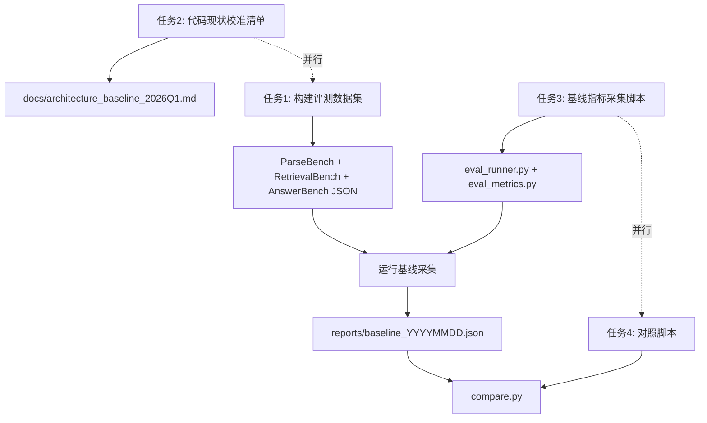

# 阶段 0: 基线固化与差异对齐 — 具体实施计划

## 目标

在不修改任何业务代码的前提下，完成四件事：

1. 构建四类评测数据集（ParseBench / RetrievalBench / AnswerBench / LatencyBench）
2. 输出代码现状校准清单（逐模块确认已实现 vs 未实现能力）
3. 在当前代码上采集基线指标
4. 建立 baseline vs candidate 自动对照脚本

## 当前现状分析

### 已有资产

- **4 篇测试 PDF**: `backend/tests/test_doc/` 下有 3 篇 RAG survey + 1 篇 Cybersecurity 论文
- **Live eval 脚本**: `backend/tests/run_llm_live_eval.sh` 可注册用户、上传 PDF、调用 RAG/Agent/Writing/Memory API 并保存请求响应
- **14 次历史 eval 运行**: `backend/tests/llm_eval_results/` 下有时间戳目录
- **单元测试**: PDF 标题质量、KG 噪声过滤等回归测试
- **完整业务链路**: PDF 解析 -> 分块 -> BGE-M3 向量化 -> Milvus + ES 双路索引 -> HybridRetriever(RRF) -> LLM Rerank -> 证据治理 -> LLM 生成

### 缺失项

- 无正式的 ground-truth QA 标注数据集
- 无 PDF 解析正确率的结构化评测
- 无 Recall@K / nDCG@K 等 IR 标准指标的自动计算
- 无 baseline vs candidate 对比框架
- 无代码能力校准清单文档

---

## 任务 1: 构建评测数据集

### 1.1 ParseBench (PDF 解析质量)

**位置**: `backend/tests/eval_baseline/parse_bench/`

- 从 `test_doc/` 中已有 4 篇 PDF 为起点
- 需补充至 >= 20 篇，覆盖四种类型各 >= 5 篇:
  - 双栏论文 (ACM/IEEE 格式)
  - 公式密集 (数学/ML 论文)
  - 扫描件
  - 表格密集
- 每篇 PDF 抽检 2-3 页，人工标注期望输出 (标题、摘要、章节结构、表格/公式是否正确还原)
- **格式**: `parse_bench_manifest.json` 列出每篇 PDF 及其标注

```json
{
  "id": "PB-001",
  "pdf_path": "test_doc/Gao_2024_RAG_Survey.pdf",
  "category": "dual_column",
  "expected": {
    "title": "Retrieval-Augmented Generation for Large Language Models: A Survey",
    "has_abstract": true,
    "section_count_approx": 8,
    "has_tables": true,
    "has_formulas": false,
    "sample_pages": [1, 5, 10],
    "notes": "双栏 ACM 格式"
  }
}
```

**现实约束**: 完整 20 篇标注工作量大，初期可先用已有 4 篇 + 手工补充 6-8 篇核心论文达到 10-12 篇的最小可用集。

### 1.2 RetrievalBench (检索质量)

**位置**: `backend/tests/eval_baseline/retrieval_bench/`

- 构建 >= 50 条 query-relevance 标注
- 分三类:
  - 精确术语查询 (~20 条): "What dataset did Gao et al. use for evaluation?"
  - 语义模糊查询 (~15 条): "How does retrieval quality affect generation?"
  - 跨文献查询 (~15 条): "Compare RAG evolution taxonomies across surveys"
- 每条标注 `relevant_paper_ids` + `relevant_chunk_keywords`

```json
{
  "id": "RB-001",
  "query": "What are the main components of a RAG system?",
  "category": "precise_term",
  "relevant_paper_ids": [1, 2, 3],
  "relevant_keywords": ["retriever", "generator", "indexing"],
  "difficulty": "easy"
}
```

**实现方式**: 基于现有 `run_llm_live_eval.sh` 中的 4 条 RAG 问题扩展，利用 DeepSeek API 辅助生成初始标注，人工校验。

### 1.3 AnswerBench (回答质量)

**位置**: `backend/tests/eval_baseline/answer_bench/`

- > = 30 条，三类各 10 条:
  - 简单事实 (10): 单文献、单段落可答
  - 跨段落 (10): 需要同一文献多处信息综合
  - 复杂多步 (10): 需跨文献推理或多步骤分析
- 每条包含标准答案要点 (`expected_answer_points`)

```json
{
  "id": "AB-001",
  "category": "simple_fact",
  "question": "在 Gao 2024 的综述中，RAG 被分为哪几个阶段？",
  "related_paper_ids": [1],
  "expected_answer_points": [
    "Naive RAG",
    "Advanced RAG",
    "Modular RAG"
  ],
  "difficulty": "easy",
  "eval_focus": ["coverage", "citation_accuracy"]
}
```

### 1.4 LatencyBench (性能基准)

复用 RetrievalBench + AnswerBench 的 query 集，不需要额外标注。自动采集:

- P50 / P95 / P99 延迟
- 按 API 端点分类 (RAG ask / RAG stream / Agent ask)

### 1.5 High-Value Queries (高价值样本)

**位置**: `backend/tests/eval_baseline/high_value_queries.json`

按方案 11.3 节格式构建 >= 20 条样本，覆盖 5 类场景。这是 AnswerBench 的核心子集。

---

## 任务 2: 代码现状校准清单

**输出**: `[docs/architecture_baseline_2026Q1.md](docs/architecture_baseline_2026Q1.md)`

逐模块审查并记录以下维度:


| 模块       | 审查内容                                                                   | 关键文件                                                                                                                                        |
| -------- | ---------------------------------------------------------------------- | ------------------------------------------------------------------------------------------------------------------------------------------- |
| PDF 解析   | TextExtractor + OCR + LayoutAnalyzer 实际能力边界                            | `[backend/app/services/pdf_parser.py](backend/app/services/pdf_parser.py)`, `[layout_analyzer.py](backend/app/services/layout_analyzer.py)` |
| 元数据提取    | 正则 vs LLM 路径的实际启用状态                                                    | `pdf_parser.py` MetadataExtractor / LLMMetadataExtractor                                                                                    |
| 文本切分     | SemanticChunker 实际参数和无父子结构确认                                           | `[backend/app/rag/chunker.py](backend/app/rag/chunker.py)` (chunk_size=1024, overlap=128)                                                   |
| 向量化      | BGE-M3 dense-only 确认，无 sparse 输出                                       | `[backend/app/rag/engine.py](backend/app/rag/engine.py)` `embed()` 方法                                                                       |
| 检索       | HybridRetriever(BM25+Dense+RRF) 已实现，vector_weight=0.6, bm25_weight=0.4 | `[backend/app/rag/retriever.py](backend/app/rag/retriever.py)`                                                                              |
| 重排序      | LLM-based rerank (非专用 reranker 模型)                                     | `engine.py` `_rerank()`                                                                                                                     |
| 证据治理     | 参考文献过滤 + 行政噪声过滤 + 低信号过滤 + 多文献多样性                                       | `engine.py` `_prepare_evidence()`                                                                                                           |
| Agent 编排 | coordinator 固定路由 + asyncio.gather 并发                                   | `[backend/app/agents/coordinator.py](backend/app/agents/coordinator.py)`                                                                    |
| 记忆系统     | DynamicMemory + Reconstructive + Cross 组合                              | `backend/app/rag/memory_engine/`                                                                                                            |
| 配置管理     | 无 Feature Flag 机制，无 sparse/reranker/mineru 配置                          | `[backend/app/core/config.py](backend/app/core/config.py)`                                                                                  |


每个模块输出: **已实现能力** / **未实现能力** / **质量评级** / **后续阶段改造点**

---

## 任务 3: 基线指标采集脚本

**位置**: `backend/tests/eval_baseline/`

### 3.1 eval_runner.py — 评测主入口

```python
class BaselineEvaluator:
    """基线评测运行器"""
    async def run_parse_bench() -> ParseBenchReport
    async def run_retrieval_bench() -> RetrievalBenchReport
    async def run_answer_bench() -> AnswerBenchReport
    async def run_latency_bench() -> LatencyBenchReport
    async def run_all() -> BaselineReport
    def save_report(report, output_dir)
```

### 3.2 eval_metrics.py — 指标计算

- `recall_at_k(retrieved, relevant, k)` — Recall@K
- `ndcg_at_k(retrieved, relevant, k)` — nDCG@K
- `citation_consistency(answer, evidence)` — 引用一致性（正则匹配引用编号）
- `answer_coverage(answer, expected_points)` — 答案完整度（基于 DeepSeek API 评估要点覆盖）
- `parse_quality_score(parsed_doc, expected)` — 解析正确率

### 3.3 运行流程

1. 启动后端服务（或直接 import engine）
2. 加载评测数据集 JSON
3. 按数据集逐条执行
4. 计算指标
5. 输出报表到 `backend/tests/eval_baseline/reports/baseline_YYYYMMDD.json`

---

## 任务 4: Baseline vs Candidate 对照脚本

**位置**: `backend/tests/eval_baseline/compare.py`

```python
class BaselineComparator:
    """对比两次评测报告"""
    def compare(baseline_path, candidate_path) -> ComparisonReport
    def check_regression(comparison) -> bool  # 是否有指标退化
    def print_summary(comparison)  # 输出对比表格
```

输出格式:

```
指标            | 基线     | 候选     | 差值    | 状态
Recall@10      | 0.65    | 0.72    | +0.07  | PASS
nDCG@10        | 0.58    | 0.61    | +0.03  | PASS
引用一致性       | 0.70    | 0.68    | -0.02  | WARN
答案完整度       | 0.55    | 0.60    | +0.05  | PASS
P95 延迟(ms)    | 3200    | 3500    | +300   | PASS (<=20%)
```

---

## 目录结构总览

```
backend/tests/eval_baseline/
├── README.md                          # 评测框架说明
├── parse_bench/
│   ├── parse_bench_manifest.json      # PDF 解析评测集清单
│   └── annotations/                   # 逐篇标注文件
├── retrieval_bench/
│   └── retrieval_bench.json           # 检索评测集
├── answer_bench/
│   └── answer_bench.json              # 回答评测集
├── high_value_queries.json            # 高价值样本
├── eval_runner.py                     # 评测主入口
├── eval_metrics.py                    # 指标计算
├── compare.py                         # 对照脚本
├── conftest.py                        # pytest 配置
└── reports/                           # 评测报告输出目录
    └── baseline_YYYYMMDD.json

docs/
└── architecture_baseline_2026Q1.md    # 代码现状校准清单
```

---

## 执行顺序与依赖




- 任务 1 和任务 2 可并行
- 任务 3 和任务 4 可并行，但需任务 1 的数据集就绪后才能运行
- 最终运行基线采集需要后端服务可用 + 评测数据集 + 采集脚本三者齐备

## 关键决策

- **评测方式**: 优先使用 API 调用方式（通过 HTTP 调后端），与 `run_llm_live_eval.sh` 保持一致，更贴近真实场景。同时提供直接 import engine 的离线模式作为备选。
- **标注辅助**: 利用 DeepSeek API 辅助生成初始评测标注，然后人工校验修正，降低纯手工标注成本。
- **最小可用集**: 初期 ParseBench 10-12 篇、RetrievalBench 30 条、AnswerBench 20 条即可启动基线采集，后续补充。
- **可重复性**: 所有随机因素（LLM temperature）记录在报告中，3 轮取均值。

