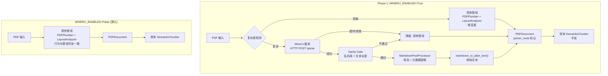

# Phase 1: MinerU PDF 解析集成 -- 详细实施方案 (v2)

## 一、Phase 0 基线结论与 Phase 1 定位

### 基线数据摘要


| 评测维度 | 核心指标                       | 数值              | 判定   |
| ---- | -------------------------- | --------------- | ---- |
| 解析质量 | avg_parse_score            | 47.92%          | 严重不足 |
| 检索质量 | Recall@10 / @20            | 90.67% / 97.33% | 良好   |
| 回答覆盖 | avg_coverage_ratio         | 5.83%           | 极差   |
| 引用一致 | avg_consistency_ratio      | 98.95%          | 优秀   |
| 结构完整 | avg_structure_completeness | 100%            | 完美   |


### Phase 1 定位: 必要但不充分

5.83% 的答案覆盖率是**多因素叠加**的结果:

- **解析链**: 全部 21 篇文档 `section_count_parsed = 0`、`has_tables/formulas/figures_parsed = false`，PDFPlumber 只输出纯文本，丢失全部文档结构 -- 这是 Phase 1 聚焦解决的问题
- **评测口径**: `answer_coverage_keyword` 基于关键词精确匹配，对近义改写/换序容易误判为未覆盖 -- 需在后续迭代中补充语义匹配评测
- **生成链**: answer latency 均值 187s、p95 257s，DeepSeek reasoner 的长思考可能导致答案发散 -- 与解析无关，属后续优化
- **切片粒度**: 平级分块破坏章节逻辑 -- 属 Phase 2 (父子索引) 范畴

**Phase 1 目标**: 解决解析链这一个维度的短板。不宣称"接 MinerU 就能解决回答质量"，但为后续 Phase 2-4 提供结构化数据基础。

---

## 二、Phase 1 约束边界


| 约束项       | 规则                                                                  | 理由                                   |
| --------- | ------------------------------------------------------------------- | ------------------------------------ |
| 简单 PDF 路径 | **不动**，继续走现有 PDFPlumber + LayoutAnalyzer                            | 上位方案明确要求沿用现有快路; 避免同时引入两类变量           |
| Chunker   | **不改**，MinerU 输出转为纯文本后交给现有 SemanticChunker                          | 章节感知/父子结构属 Phase 2 scope             |
| MinerU 部署 | **独立服务**，主后端只保留 HTTP client                                         | 避免 magic-pdf 重依赖污染主后端环境; 适配本地+远端混合部署 |
| 在线质量评分    | **仅做轻量 sanity gate** (乱码率 + 文本长度)，不做 formula_fidelity/reading_order | 无 ground truth 的在线评分不稳定，误判会导致双重不稳定   |
| 数据结构      | **必须定义明确的数据契约**，包括新增字段 schema 和旧数据兼容策略                              | 否则"下游无感知"无法保证                        |


---

## 三、改动文件清单与实施步骤

### Step 1: 搭建 MinerU 独立解析服务

**位置**: `mineru_service/` (项目根目录下新建，独立于主后端)

```
mineru_service/
  Dockerfile
  requirements.txt        # magic-pdf, fastapi, uvicorn, PyMuPDF
  app.py                  # FastAPI wrapper
  config.py               # MINERU_MODEL_PATH, WORKERS, TIMEOUT 等
```

**核心端点**:

```
POST /parse
  Input:  multipart/form-data { file: PDF binary }
  Output: {
    "markdown": "...",           # 完整 Markdown 文本
    "pages": [                   # 按页分段
      {"page_number": 1, "markdown": "..."}
    ],
    "metadata": {
      "title": "...",
      "has_tables": true,
      "has_formulas": true,
      "has_figures": true,
      "section_titles": ["Introduction", "Related Work", ...]
    },
    "parser_version": "mineru-2.5-1.2b",
    "elapsed_ms": 4200
  }

GET /health
  Output: {"status": "ok", "model_loaded": true, "gpu_memory_mb": 5800}
```

**运维约束** (在 `mineru_service/config.py` 中配置):


| 约束项                | 默认值          | 说明                                           |
| ------------------ | ------------ | -------------------------------------------- |
| `MAX_FILE_SIZE_MB` | 100          | 单文件上传上限; 超过返回 413                            |
| `TASK_TIMEOUT_SEC` | 300          | 单任务硬超时; 超过返回 504 并终止推理                       |
| `MAX_CONCURRENT`   | 2            | 并发解析上限 (Semaphore); 超过排队或返回 503              |
| `BIND_HOST`        | `0.0.0.0`    | 生产环境改为内网 IP 或配合防火墙仅允许主后端访问                   |
| `API_KEY`          | `""` (空=不校验) | 非空时校验 `Authorization: Bearer {key}`; 内网部署可留空 |


**错误码约定**:


| HTTP 状态码 | 含义          | 主后端处理                                              |
| -------- | ----------- | -------------------------------------------------- |
| 200      | 解析成功        | 正常消费 response                                      |
| 400      | PDF 损坏/无法解析 | 降级到 legacy                                         |
| 413      | 文件过大        | 降级到 legacy, 记录 `fallback_reason="file_too_large"`  |
| 503      | 并发已满        | 降级到 legacy, 记录 `fallback_reason="service_busy"`    |
| 504      | 解析超时        | 降级到 legacy, 记录 `fallback_reason="service_timeout"` |
| 5xx      | 服务内部错误      | 降级到 legacy, 记录 `fallback_reason`                   |


**部署**: 4090 服务器上通过 Docker 启动，暴露端口 (如 8010)，仅允许内网访问。Mac Mini 开发机通过 HTTP 调用。

### Step 2: 新增 Feature Flags

**文件**: [backend/app/core/config.py](backend/app/core/config.py)

```python
# Phase 1: MinerU 解析
MINERU_ENABLED: bool = False              # MinerU 总开关 (仅对复杂 PDF 生效)
MINERU_API_URL: str = "http://localhost:8010"  # MinerU 服务地址
PDF_PARSE_TIMEOUT: int = 120              # MinerU 单文档超时 (秒)
```

**注意**: 不设 `PARSER_ROUTER_ENABLED`。当 `MINERU_ENABLED=False` 时，全部 PDF 走现有 legacy 管线 (PDFPlumber + LayoutAnalyzer)，行为与基线完全一致。当 `MINERU_ENABLED=True` 时，仅复杂 PDF 走 MinerU，简单 PDF 仍走现有管线。

### Step 3: 新建 MinerU HTTP Client + Markdown 后处理器

**文件 A**: `backend/app/services/mineru_client.py` (新增)

```python
class MinerUClient:
    """MinerU 解析服务 HTTP 客户端"""

    def __init__(self, base_url: str, timeout: int = 120):
        self.base_url = base_url
        self.timeout = timeout
        # 使用 httpx.AsyncClient, 带重试 (最多 2 次)

    async def parse(self, pdf_path: str) -> MinerUResponse:
        """POST /parse, 返回 MinerUResponse dataclass"""
        ...

    async def health_check(self) -> bool:
        """GET /health"""
        ...
```

`MinerUResponse` dataclass:

```python
@dataclass
class MinerUResponse:
    markdown: str
    pages: List[Dict]         # [{"page_number": int, "markdown": str}]
    metadata: Dict            # title, has_tables, has_formulas, section_titles, ...
    parser_version: str
    elapsed_ms: int
```

**文件 B**: `backend/app/services/markdown_processor.py` (新增)

```python
class MarkdownPostProcessor:
    """清洗 MinerU 输出的 Markdown"""

    def process(self, markdown: str) -> str:
        """清洗步骤:
        1. 合并跨行段落断行
        2. 标准化 LaTeX 公式分隔符
        3. 标准化 Markdown 表格格式
        4. 移除页眉页脚噪声
        """
        ...

    def extract_metadata(self, markdown: str) -> Dict:
        """从 Markdown 结构中提取:
        - title: 第一个 H1
        - abstract: "Abstract" 标题下的段落
        - section_titles: 所有 H2/H3 标题列表
        - has_tables: 是否包含 Markdown 表格
        - has_formulas: 是否包含 $...$ 或 $$...$$ 
        - has_figures: 是否包含 
        """
        ...

    def markdown_to_plain_text(self, markdown: str) -> str:
        """将 Markdown 转为纯文本 (去除标记符号),
        用于交给现有 SemanticChunker -- Phase 1 不改 chunker"""
        ...
```

### Step 4: 新建轻量 Sanity Gate

**文件**: `backend/app/services/parse_sanity.py` (新增)

**设计原则**: 只做两项可靠的硬门槛判断，不做需要 ground truth 的"质量评分"。

```python
class ParseSanityGate:
    """MinerU 输出的健全性检查 -- 仅做硬门槛, 不做软评分"""

    GARBLE_THRESHOLD = 0.15     # 乱码字符占比上限
    MIN_TEXT_RATIO = 0.3        # 输出文本长度 / PDF 页数的最低比值

    def check(self, mineru_response: MinerUResponse, page_count: int) -> SanityResult:
        """
        Returns:
            SanityResult(passed=bool, reason=Optional[str])

        仅检查两项:
        1. garble_rate: 非 ASCII/CJK/标点 字符占比 > 阈值 → 不通过
        2. text_length: 总文本长度 / 页数 < 最低比值 → 不通过 (说明大量内容丢失)
        """
        ...
```

**不做的事**: formula_fidelity、reading_order、table_integrity 等需要 ground truth 对比的项，留给离线 ParseBench 评测。

### Step 5: 定义数据契约

#### 5a. PDFDocument 扩展字段

**文件**: [backend/app/services/pdf_parser.py](backend/app/services/pdf_parser.py) 中的 `PDFDocument` dataclass

```python
@dataclass
class SectionInfo:
    """章节信息 -- 固定 schema, 避免 Dict 字段漂移"""
    title: str                         # 章节标题, e.g. "3.2 Experimental Setup"
    level: int                         # 标题层级: 1=H1, 2=H2, 3=H3
    page_start: int                    # 起始页码 (1-based)
    page_end: Optional[int] = None     # 结束页码 (同页时与 page_start 相同; None 表示未知)
    anchor: Optional[str] = None       # 定位锚点, e.g. "sec-3-2" (Phase 2 父子索引使用)

@dataclass
class PDFDocument:
    # --- 现有字段 (不变) ---
    file_path: str
    title: Optional[str] = None
    authors: List[str] = field(default_factory=list)
    abstract: Optional[str] = None
    keywords: List[str] = field(default_factory=list)
    pages: List[PDFPage] = field(default_factory=list)
    full_text: str = ""
    metadata: Dict[str, Any] = field(default_factory=dict)

    # --- Phase 1 新增字段 (全部 Optional, 旧路径不填即可) ---
    parser_route: str = "legacy"                    # "legacy" | "mineru"
    parser_version: Optional[str] = None            # e.g. "mineru-2.5-1.2b"
    raw_markdown: Optional[str] = None              # MinerU 原始 Markdown (仅 mineru 路径)
    sections: List[SectionInfo] = field(default_factory=list)  # 固定 schema
    has_tables: Optional[bool] = None
    has_formulas: Optional[bool] = None
    has_figures: Optional[bool] = None
```

**SectionInfo 设计说明**:

- 固定 5 个字段 (`title`, `level`, `page_start`, `page_end`, `anchor`)，不允许随意追加 key
- `anchor` 字段 Phase 1 可以先填 None, Phase 2 父子索引时补全为 `"sec-{level}-{index}"`
- `page_end` 在 Phase 1 中可按"下一个同级/上级标题的 page_start - 1"推算, 或填 None

**兼容性**: 全部新增字段均为 Optional 且有默认值。legacy 路径产出的 `PDFDocument` 自动取默认值 (`parser_route="legacy"`, `sections=[]`, 其余 None)，下游代码无需任何修改即可正常工作。

#### 5b. parse_result 扩展

**文件**: [backend/app/api/v1/papers.py](backend/app/api/v1/papers.py) 中 `paper.parse_result` 字段

```python
paper.parse_result = {
    # 现有字段
    "chunk_count": len(chunks),
    "skipped_reference_chunks": skipped_reference_chunks,
    "skipped_reference_pages": skipped_reference_pages,
    # Phase 1 新增 -- 路由诊断
    "parser_route": doc.parser_route,              # "legacy" | "mineru"
    "parser_version": doc.parser_version,          # None | "mineru-2.5-1.2b"
    "complexity": doc.metadata.get("complexity"),   # "simple" | "complex"
    "route_reason": doc.metadata.get("route_reason"),
        # "plain_text" | "scanned_pdf" | "contains_images" | "multi_page_document"
    "fallback_reason": doc.metadata.get("fallback_reason"),
        # None (正常) | "sanity_garble" | "sanity_text_short"
        # | "service_timeout" | "service_busy" | "file_too_large" | 其他异常信息
    # Phase 1 新增 -- 解析产出
    "has_tables": doc.has_tables,
    "has_formulas": doc.has_formulas,
    "has_figures": doc.has_figures,
    "section_count": len(doc.sections),
    "mineru_elapsed_ms": ...,                      # MinerU 解析耗时 (仅 mineru 路径)
}
```

#### 5c. MongoDB chunks 文档

不改 schema。MinerU 路径产出的 chunks 在文本内容上更完整 (含表格文本化、公式 LaTeX)，但 chunk 文档结构与 legacy 完全一致。**Phase 2 才引入 parent_id / section_path 等新字段**。

#### 5d. 旧数据兼容与重处理

- `parse_result` 中没有 `parser_route` 字段的文献，视为 `"legacy"` 路径产出
- 不强制重处理旧文献; 提供可选的 `reparse` API 或脚本，按需触发单篇/批量重解析
- 重解析后覆盖 chunks + 重建向量索引，通过现有 `index_paper` 逻辑完成

### Step 6: 改造 PDFParser 路由逻辑

**文件**: [backend/app/services/pdf_parser.py](backend/app/services/pdf_parser.py)

改动要点:

1. 将现有 `parse()` 整体封装为 `_parse_legacy(pdf_path) -> PDFDocument`，内部逻辑一字不改
2. 新增 `_detect_complexity(pdf_path) -> ComplexityResult` 方法:

```python
@dataclass
class ComplexityResult:
    complexity: str          # "simple" | "complex"
    route_reason: str        # 人可读的判定理由, 记入 parse_result

def _detect_complexity(self, pdf_path: str) -> ComplexityResult:
    """轻量复杂度检测 -- 仅用 PyMuPDF (fitz) 页级元信息, 不做文本提取"""
    import fitz
    doc = fitz.open(pdf_path)

    signals = []
    is_scanned = True
    has_images = False
    for page in doc:
        text_len = len(page.get_text("text"))
        image_count = len(page.get_images())
        if text_len > 50:
            is_scanned = False
        if image_count > 0:
            has_images = True

    # 判定规则 (任一命中即 complex):
    # 1. 扫描件 (全部页面文本 < 50 chars)
    # 2. 页面含嵌入图像 (可能是双栏/图表)
    # 3. 页数 > 1 且非纯文本 (学术论文特征)
    if is_scanned:
        return ComplexityResult("complex", "scanned_pdf")
    if has_images:
        return ComplexityResult("complex", "contains_images")
    if doc.page_count > 3:
        return ComplexityResult("complex", "multi_page_document")
    return ComplexityResult("simple", "plain_text")
```

**设计要点**: 使用 `fitz.open()` 只读取页面元信息 (文本长度、图像数量)，不调用 `TextExtractor` 做全量文本提取，耗时 < 50ms。

1. 新增 `_parse_with_mineru(pdf_path, route_reason) -> PDFDocument` 方法:
  - 调用 `MinerUClient.parse()` 获取 MinerU 结果
  - `ParseSanityGate.check()` 做健全性检查
  - 不通过 → 降级到 `_parse_legacy()`，记录 `fallback_reason`
  - 通过 → `MarkdownPostProcessor` 清洗和元数据提取
  - 组装 `PDFDocument`，`pages[].text` 为**纯文本** (由 `markdown_to_plain_text()` 转换)
  - `raw_markdown` 保存原始 Markdown (供 Phase 2 父子索引使用)
  - 填充 `parser_route="mineru"`, `sections`, `has_tables` 等新增字段
2. 新的 `parse()` 主流程:

```python
async def parse(self, pdf_path: str) -> PDFDocument:
    if not settings.MINERU_ENABLED:
        doc = await self._parse_legacy(pdf_path)
        doc.parser_route = "legacy"
        return doc

    cr = self._detect_complexity(pdf_path)
    if cr.complexity == "simple":
        doc = await self._parse_legacy(pdf_path)
        doc.parser_route = "legacy"
        doc.metadata["complexity"] = cr.complexity
        doc.metadata["route_reason"] = cr.route_reason
        return doc

    # 复杂 PDF: MinerU + 降级
    try:
        doc = await self._parse_with_mineru(pdf_path, cr.route_reason)
        doc.metadata["complexity"] = cr.complexity
        doc.metadata["route_reason"] = cr.route_reason
        return doc
    except Exception as e:
        logger.warning(f"MinerU failed, falling back to legacy: {e}")
        doc = await self._parse_legacy(pdf_path)
        doc.parser_route = "legacy"
        doc.metadata["complexity"] = cr.complexity
        doc.metadata["route_reason"] = cr.route_reason
        doc.metadata["fallback_reason"] = str(e)
        return doc
```

**关键点**: 简单 PDF 走 `_parse_legacy()` -- 即现有 PDFPlumber + LayoutAnalyzer 管线，零变更。复杂度检测仅用 PyMuPDF 页级元信息，不与 legacy 提取耦合。

### Step 7: 适配 papers.py

**文件**: [backend/app/api/v1/papers.py](backend/app/api/v1/papers.py)

改动范围**极小**，仅在 `process_paper_async` 中:

1. `parse_result` dict 中追加 Step 5b 定义的新字段 (parser_route, parser_version, has_tables 等)
2. **不改分块逻辑**: `PDFDocument.pages[].text` 无论来自 legacy 还是 MinerU，都是纯文本，直接交给现有 `SemanticChunker` 和 `_extract_layout_page_text()`

**不做的事**: 不引入 MarkdownAwareChunker，不改动 chunker.py。MinerU 输出的 Markdown 由 `markdown_to_plain_text()` 转为纯文本后，走现有分块流程。章节感知分块属于 Phase 2。

### Step 8: 部署与依赖

**主后端** (`backend/requirements.txt`):

- 仅新增 `httpx` (如尚未存在) 用于 MinerU HTTP 调用
- **不引入** `magic-pdf`、`torch` 等重依赖

**MinerU 服务** (`mineru_service/requirements.txt`):

- `magic-pdf[full]`
- `fastapi`, `uvicorn`
- `PyMuPDF`

**部署方式**:


| 环境          | MinerU 服务                  | 主后端                                       |
| ----------- | -------------------------- | ----------------------------------------- |
| 4090 服务器    | Docker 容器, GPU 直通, 端口 8010 | 连接 `MINERU_API_URL=http://localhost:8010` |
| Mac Mini M4 | 不部署                        | 连接 `MINERU_API_URL=http://<4090-ip>:8010` |
| CI / 测试     | 不启动                        | `MINERU_ENABLED=False`, 走 legacy          |


### Step 9: 验证与验收

#### 9a. ParseBench 验收 (解析内聚)

- `avg_parse_score` >= 0.73 (基线 0.4792, 提升 >= 25pp)
- `section_count_parsed > 0` 的文档占比 >= 80%
- `has_tables_parsed = true` 的应检出文档占比 >= 70%

#### 9b. AnswerBench parse-sensitive 子集 (业务闭环)

从 AnswerBench 30 条中筛选 **parse-sensitive 子集** (依赖表格/公式/跨段落的题目):

- AB-007 (simple_fact, baseline coverage=0.25)
- AB-016 (cross_paragraph, baseline coverage=0.5)
- AB-011 ~ AB-015, AB-017 ~ AB-020 (cross_paragraph, baseline coverage=0.0)
- 共 12 条

**该子集的 baseline coverage** (从基线报告直接计算):

```
subset_items = [AB-007, AB-011..AB-020, AB-016]  # 12 条
subset_baseline = (0.25 + 0 + 0 + 0 + 0 + 0 + 0.5 + 0 + 0 + 0 + 0) / 12 ≈ 0.0625
```

**验收标准**: candidate 在该子集上的 `avg_coverage_ratio >= 0.0625` (子集自身 baseline，非全局 0.0583)。这不是要求大幅提升 (提升是 Phase 2-4 的事)，而是要求**不退化** + 观察方向性改善。若 candidate 显著高于 0.0625，记录为 Phase 1 的附带收益。

#### 9c. 回归门槛

- Recall@10 >= 基线 (0.9067)
- Recall@20 >= 基线 (0.9733)
- consistency_ratio >= 基线 (0.9895)
- Feature Flag 关闭时行为与基线完全一致
- 简单 PDF (PDFPlumber 路径) 解析速度不退化

---

## 四、关键数据流变化




---

## 五、Feature Flag 控制


| 状态                          | 行为                                                                    |
| --------------------------- | --------------------------------------------------------------------- |
| `MINERU_ENABLED=False` (默认) | 全部 PDF 走现有 legacy 管线，行为与基线完全一致                                        |
| `MINERU_ENABLED=True`       | 简单 PDF 走现有 legacy; 复杂 PDF 走 MinerU 服务，失败/不通过 sanity gate 自动降级到 legacy |


只有一个开关，语义清晰，不存在"开关组合"的歧义。

---

## 六、风险与缓解


| 风险                | 缓解                                               |
| ----------------- | ------------------------------------------------ |
| MinerU 服务不可用      | HTTP 超时 + 自动降级到 legacy; health check 上报监控        |
| MinerU 输出乱码/截断    | Sanity Gate (乱码率 + 文本长度) 拦截后降级                   |
| MinerU 解析慢 (秒级/页) | `PDF_PARSE_TIMEOUT=120s` 硬超时; 异步后台处理，不阻塞上传响应     |
| 主后端环境被污染          | MinerU 独立服务、独立依赖、独立容器                            |
| 新增字段破坏下游          | 全部 Optional + 默认值; legacy 路径产出的 PDFDocument 自动兼容 |
| 解析提升但回答没变         | 明确 Phase 1 scope 是解析链; AnswerBench 子集验收仅要求不退化    |


---

## 七、Phase 1 不做的事 (明确排除)


| 排除项                                   | 归属阶段    | 理由                                   |
| ------------------------------------- | ------- | ------------------------------------ |
| MarkdownAwareChunker / 章节感知分块         | Phase 2 | 解析升级和索引结构升级不绑死                       |
| 父子文档索引 (parent_id, section_path)      | Phase 2 | 依赖解析输出的 raw_markdown，但结构改造单独做        |
| 简单 PDF 快路切换 (PyMuPDF 替代 PDFPlumber)   | 不做      | 上位方案要求沿用现有快路; 避免多变量                  |
| formula_fidelity / reading_order 在线评分 | 不做      | 无 ground truth 不稳定; 用离线 ParseBench 评 |
| magic-pdf 塞入主 requirements.txt        | 不做      | MinerU 独立服务化                         |
| 强制重处理所有旧文献                            | 按需      | 提供 reparse 脚本，不默认触发                  |


