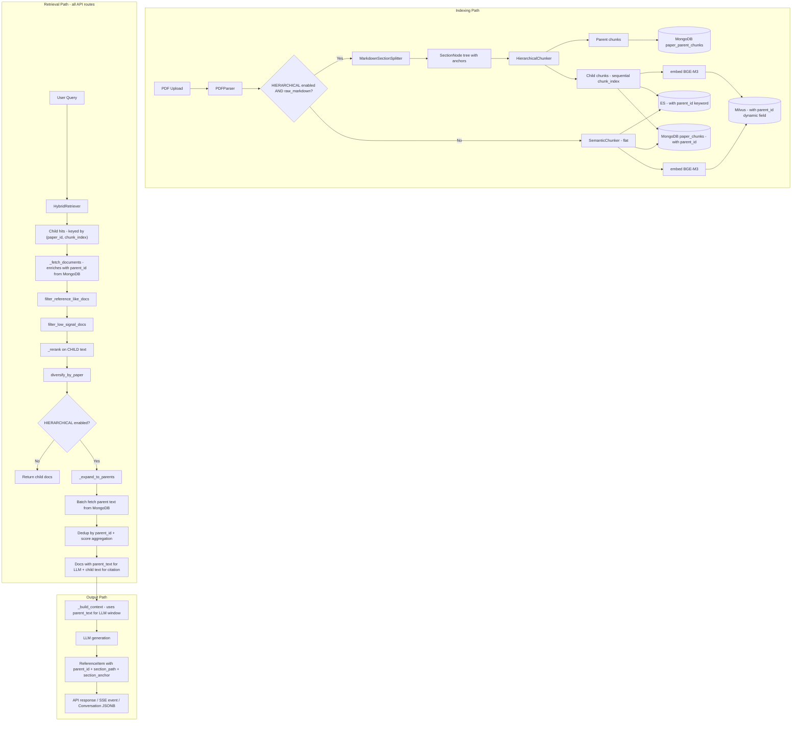

# Phase 2: Parent-Child Document Indexing - Revised Implementation Plan

## Revision Summary (vs v1)

v1 only covered the engine answer path. This revision addresses six structural gaps:

1. **Retrieval PK contract** -- `(paper_id, chunk_index)` stays as THE cross-store key; `parent_id` is metadata-only
2. **ReferenceItem + all API/conversation paths** -- `/rag/search`, `/rag/ask`, `/rag/stream`, `/agent/stream`, history replay all upgraded
3. **Evidence chain ordering** -- child filtering/reranking completes FIRST, parent expansion happens AFTER
4. **Section tree parser** -- extracted as a standalone `MarkdownSectionSplitter` in `markdown_processor.py` with text spans, stable anchors, page mapping
5. **Cleanup as blocking prerequisite** -- `delete_parent_chunks` wired in BEFORE any new indexing work begins
6. **Backward compatibility** -- old conversations and flat-chunked papers work without migration

---

## 1. Retrieval Primary Key Contract

**This is the most critical design decision and must be settled first.**

### Current cross-store key: `(paper_id, chunk_index)`

```
Milvus  paper_vectors:   id="{paper_id}_{chunk_index}", paper_id, chunk_index, project_id, vector
ES      paper_chunks:    paper_id, chunk_index, text, text_en, project_id
MongoDB paper_chunks:    paper_id, chunk_index, text, page_number, metadata
RRF fusion dedup key:    (paper_id, chunk_index)   [retriever.py line 453]
```

### Phase 2 rule

- `**chunk_index` remains the sequential child index** (0, 1, 2, ...) exactly as today. It is the retrieval-time join key across Milvus, ES, and MongoDB `paper_chunks`.
- `**parent_id` is an opaque metadata string** stored alongside each child in all three stores. It is NOT used for retrieval dedup or RRF fusion. It is only used post-retrieval to fetch the parent text from MongoDB `paper_parent_chunks`.
- **Parent chunks are stored ONLY in MongoDB** `paper_parent_chunks` collection, keyed by `parent_id`. They are never embedded, never in Milvus, never in ES.
- `**parent_id` format**: `"{paper_id}_p{seq}"` (e.g., `"42_p3"`) -- deterministic, rebuildable, no UUID.
- **RRF fusion, score comparison, diversification** continue to operate on `(paper_id, chunk_index)` with zero changes.

### Where this shows up in code


| Store                         | Field added                                                                                                 | Purpose                                 |
| ----------------------------- | ----------------------------------------------------------------------------------------------------------- | --------------------------------------- |
| Milvus `paper_vectors`        | `parent_id` (dynamic field)                                                                                 | Propagated to `_fetch_documents` output |
| ES `paper_chunks`             | `parent_id` (keyword field)                                                                                 | Same                                    |
| MongoDB `paper_chunks`        | `parent_id`, `section_path`, `section_anchor`                                                               | Enriches child doc on fetch             |
| MongoDB `paper_parent_chunks` | `parent_id` (PK), `paper_id`, `text`, `section_path`, `section_anchor`, `child_chunk_indices`, `page_range` | Parent text store                       |


---

## 2. Section Tree Parser (markdown_processor.py)

**This is the hardest piece of Phase 2 engineering.** The existing `extract_sections()` gives flat `(title, level, page_start)` with no text spans and `anchor=None`. Phase 2 needs actual section bodies with stable anchors.

### New class: `MarkdownSectionSplitter`

File: [backend/app/services/markdown_processor.py](backend/app/services/markdown_processor.py)

```python
@dataclass
class SectionNode:
    title: str
    level: int                         # 1, 2, 3
    path: str                          # "1 Introduction" or "3.2 Experiments > Setup"
    anchor: str                        # stable slug: "sec-3-2-experiments-setup"
    text: str                          # full section body (heading + content until next same/higher heading)
    char_start: int                    # offset in source markdown
    char_end: int                      # offset in source markdown
    page_start: int
    page_end: int
    children: List['SectionNode']      # H2 under H1, H3 under H2

class MarkdownSectionSplitter:
    def split(self, markdown: str, existing_sections: List[SectionInfo] = None) -> List[SectionNode]:
        """
        Args:
            markdown: full cleaned markdown (doc.raw_markdown)
            existing_sections: pre-computed SectionInfo list (doc.sections) with correct page numbers.

        Steps:
        1. Regex-scan headings with char offsets
        2. Slice markdown into sections at heading boundaries
        3. Build parent-child tree based on heading level
        4. Generate stable anchors from path slugification
        5. Map headings to page numbers by matching against existing_sections (title, level)
        6. Return LEAF sections (lowest-level) as the parent chunk candidates
        """
```

### Algorithm detail

1. **Heading scan**: `re.finditer(r"^(#{1,3})\s+(.+)$", markdown, re.MULTILINE)` -- same regex as existing `extract_sections()`.
2. **Text slicing**: Section i's text = `markdown[heading_i_start : heading_(i+1)_start]`. Last section extends to end of document.
3. **Tree building**: Stack-based. When a new heading has level <= current, pop stack back to parent level.
4. **Anchor generation**: `f"sec-{slugify(path)}"` where slugify lowercases, replaces non-alnum with `-`, truncates to 128 chars.
5. **Page mapping**: See "Page mapping strategy" below -- does NOT use `_build_page_boundaries`.
6. **Leaf extraction**: Walk tree, return leaves (sections with no children). These become parent chunks. If a leaf exceeds `PARENT_CHUNK_MAX_TOKENS`, split it into pseudo-sections.

### Page mapping strategy (critical subtlety)

`_build_page_boundaries` maps char offsets to pages using per-page markdown lengths from `mineru_response.pages`. But at `process_paper_async` time, `mineru_response.pages` is gone -- `doc.pages[i].text` is **plain text** (after `markdown_to_plain_text`), NOT per-page markdown. Using plain-text lengths as markdown char boundaries would produce wrong page numbers.

However, `doc.sections` (the `SectionInfo` list) was computed at parse time when `mineru_response.pages` was still available, and it already has correct `page_start`/`page_end`. So `MarkdownSectionSplitter` uses `doc.sections` as its page mapping source:

```python
class MarkdownSectionSplitter:
    def split(self, markdown: str, existing_sections: List[SectionInfo] = None) -> List[SectionNode]:
        """
        Args:
            markdown: full cleaned markdown (doc.raw_markdown)
            existing_sections: pre-computed SectionInfo list (doc.sections) with correct page numbers.
                               Used to map headings to page ranges. If None, all pages default to 1.
        """
```

**Matching logic**: For each heading found by regex in `markdown`, find the corresponding `SectionInfo` by matching `(title, level)`. Inherit `page_start`/`page_end` from the match. This works because both use the same heading regex on the same markdown source.

**Fallback**: If no `existing_sections` provided (legacy path or simple PDF), all sections get `page_start=1, page_end=1`. This is acceptable because flat-chunked papers already lack accurate per-section page info.

### Existing `extract_sections()` and `SectionInfo`

Keep as-is for backward compatibility. `MarkdownSectionSplitter` is a new class that `HierarchicalChunker` calls directly. It consumes the *output* of `extract_sections()` for page data. Update `SectionInfo.anchor` to be populated when `HIERARCHICAL_CHUNKING_ENABLED` is on (it is currently always `None`).

---

## 3. Extended Chunk Dataclass

File: [backend/app/rag/chunker.py](backend/app/rag/chunker.py)

```python
@dataclass
class Chunk:
    text: str
    index: int
    start_char: int
    end_char: int
    metadata: dict = None
    chunk_type: str = "child"              # "parent" | "child"
    parent_id: Optional[str] = None        # child -> parent; "{paper_id}_p{seq}"
    section_path: Optional[str] = None     # "3.2 Experimental Setup"
    section_anchor: Optional[str] = None   # "sec-3-2-experimental-setup"
```

All new fields have `None`/`"child"` defaults -- existing code that creates `Chunk(text, index, start, end)` continues to work.

---

## 4. HierarchicalChunker

File: [backend/app/rag/chunker.py](backend/app/rag/chunker.py)

```python
class HierarchicalChunker:
    def __init__(self, parent_max_tokens=2000, child_max_tokens=400, child_overlap=50):
        self.splitter = MarkdownSectionSplitter()
        self.child_chunker = SemanticChunker(chunk_size=child_max_tokens, chunk_overlap=child_overlap)
        self.parent_max_tokens = parent_max_tokens

    def chunk(self, markdown: str, paper_id: int, existing_sections=None) -> List[Chunk]:
        sections = self.splitter.split(markdown, existing_sections)
        leaf_sections = self._collect_leaves(sections)
        all_chunks = []
        child_seq = 0
        for p_seq, section in enumerate(leaf_sections):
            parent_id = f"{paper_id}_p{p_seq}"

            # Handle oversized sections: split into multiple parents
            section_texts = self._maybe_split_oversized(section)
            for sub_idx, sub_text in enumerate(section_texts):
                actual_parent_id = parent_id if len(section_texts) == 1 else f"{parent_id}_{sub_idx}"

                parent = Chunk(
                    text=sub_text, index=-1, start_char=section.char_start, end_char=section.char_end,
                    chunk_type="parent", section_path=section.path, section_anchor=section.anchor,
                    metadata={"page_start": section.page_start, "page_end": section.page_end,
                              "parent_id": actual_parent_id},
                )
                parent.parent_id = actual_parent_id
                all_chunks.append(parent)

                # Create children within this parent
                children = self.child_chunker.split_text(sub_text)
                child_indices = []
                for child in children:
                    child.chunk_type = "child"
                    child.parent_id = actual_parent_id
                    child.section_path = section.path
                    child.section_anchor = section.anchor
                    child.index = child_seq
                    child.metadata = {**(child.metadata or {}),
                                      "page_number": section.page_start,
                                      "parent_id": actual_parent_id}
                    child_indices.append(child_seq)
                    child_seq += 1
                    all_chunks.append(child)

                parent.metadata["child_chunk_indices"] = child_indices
        return all_chunks
```

### Edge cases handled

- **No headings in markdown**: Treat entire document as one section
- **Section too long** (> `parent_max_tokens`): Split into sub-sections at paragraph boundaries
- **Section too short** (< 50 chars): Merge with previous section
- **Reference/bibliography sections**: Skip (reuse `_is_reference_heavy_text`)

---

## 5. MongoDB Parent Chunk CRUD

File: [backend/app/services/mongodb_service.py](backend/app/services/mongodb_service.py)

### New methods

```python
async def insert_parent_chunks(self, paper_id: int, parent_chunks: List[Dict]) -> List[str]:
    """Store parent chunks in paper_parent_chunks collection.
    Each doc: {parent_id, paper_id, section_path, section_anchor, text,
               child_chunk_indices, page_range, metadata, created_at}
    """

async def get_parent_chunks_by_ids(self, parent_ids: List[str]) -> Dict[str, Dict]:
    """Batch fetch: returns {parent_id: doc} map"""

async def delete_parent_chunks(self, paper_id: int) -> int:
    """Delete all parent chunks for a paper"""
```

### Extended `insert_chunks`

Add optional fields `parent_id`, `section_path`, `section_anchor` to each chunk doc. These are stored alongside existing fields and returned by `get_chunk_by_index`.

---

## 6. Cleanup Safety (BLOCKING PRE-REQUISITE)

**This must be implemented and tested BEFORE any new indexing code runs.**

### Files to modify


| File                                                          | Location                        | Change                                                     |
| ------------------------------------------------------------- | ------------------------------- | ---------------------------------------------------------- |
| [mongodb_service.py](backend/app/services/mongodb_service.py) | `delete_paper_chunks`           | Also call `delete_parent_chunks`                           |
| [papers.py](backend/app/api/v1/papers.py)                     | `reprocess_paper` (line 640)    | Add `await mongodb_service.delete_parent_chunks(paper_id)` |
| [papers.py](backend/app/api/v1/papers.py)                     | `delete_paper` (line 691)       | Add `await mongodb_service.delete_parent_chunks(paper_id)` |
| [engine.py](backend/app/rag/engine.py)                        | `delete_paper_index` (line 354) | Add parent chunk cache invalidation                        |


### Verification

- Unit test: after `delete_paper`, `paper_parent_chunks` collection has 0 docs for that `paper_id`
- Unit test: after `reprocess_paper`, old parent chunks are gone before new indexing starts

---

## 7. RAG Engine - Index Path

File: [backend/app/rag/engine.py](backend/app/rag/engine.py)

### Modified `index_paper`

When `HIERARCHICAL_CHUNKING_ENABLED`:

```python
parent_chunks = [c for c in chunks if c.get("chunk_type") == "parent"]
child_chunks  = [c for c in chunks if c.get("chunk_type") != "parent"]

# 1. Store parents in MongoDB only
await mongodb_service.insert_parent_chunks(paper_id, [
    {"parent_id": p["parent_id"], "paper_id": paper_id,
     "section_path": p.get("section_path"), "section_anchor": p.get("section_anchor"),
     "text": p["text"], "child_chunk_indices": p.get("metadata", {}).get("child_chunk_indices", []),
     "page_range": [p.get("metadata", {}).get("page_start"), p.get("metadata", {}).get("page_end")]}
    for p in parent_chunks
])

# 2. Index children exactly as current flat logic, but with parent_id in metadata
normalized_chunks = []  # build from child_chunks with parent_id/section_path/section_anchor
# ... existing embed/milvus/es/mongo logic on normalized_chunks ...
```

Milvus entity now includes:

```python
entities.append({
    "id": f"{paper_id}_{i}",
    "paper_id": paper_id,
    "chunk_index": i,
    "project_id": project_id or 0,
    "vector": emb,
    "parent_id": chunk.get("parent_id", ""),        # dynamic field
    "section_path": chunk.get("section_path", ""),   # dynamic field
})
```

ES doc now includes:

```python
doc = {
    "project_id": project_id or 0,
    "paper_id": paper_id,
    "chunk_index": i,
    "page_number": chunk.get("page_number", 0),
    "text": chunk.get("text", ""),
    "text_en": chunk.get("text", ""),
    "parent_id": chunk.get("parent_id", ""),         # new keyword field
}
```

BM25Retriever `_create_index` mapping gains: `"parent_id": {"type": "keyword"}`.

When flag is off: existing logic unchanged, zero diff.

---

## 8. Evidence Chain Ordering (Critical Fix)

File: [backend/app/rag/engine.py](backend/app/rag/engine.py), method `_prepare_evidence`

### Current order (stays the same for child processing)

```
search(child) -> fetch_documents -> filter_reference -> filter_low_signal -> rerank -> diversify
```

### Phase 2 addition: parent expansion AFTER all child filtering

```python
async def _prepare_evidence(self, ...):
    # --- Phase: child retrieval + filtering (UNCHANGED) ---
    search_results = await self.search(...)
    raw_docs = await self._fetch_documents(search_results)
    filtered_docs, filtered_count = self._filter_reference_like_docs(raw_docs)
    candidate_docs = filtered_docs if filtered_docs else raw_docs
    candidate_docs, admin_count, low_score_count = self._filter_low_signal_docs(candidate_docs, ...)
    reranked_docs = await self._rerank(question, candidate_docs, ...)
    final_child_docs = self._diversify_docs_by_paper(reranked_docs, top_k)

    # --- Phase: parent expansion (NEW, only when enabled) ---
    if settings.HIERARCHICAL_CHUNKING_ENABLED:
        final_docs = await self._expand_to_parents(final_child_docs)
    else:
        final_docs = final_child_docs

    return memory_results, final_docs, retrieval_meta
```

### New method `_expand_to_parents`

```python
async def _expand_to_parents(self, child_docs: List[Dict]) -> List[Dict]:
    """
    Post-filtering parent expansion:
    1. Collect unique parent_ids from final child docs
    2. Batch-fetch parent texts from MongoDB
    3. Group children by parent_id
    4. For each parent: merge child scores (max), attach parent text as 'context_text'
    5. Deduplicate: if N children point to the same parent, emit ONE doc with
       parent text + aggregated score, but preserve ALL child citation anchors
    6. Return expanded docs (child text for citation reference, parent text for LLM context)
    """
```

### What each doc looks like after expansion

```python
{
    # Retrieval key (unchanged)
    "paper_id": 42,
    "chunk_index": 7,           # original child chunk_index (for citation)
    "text": "child text...",    # original child text (for citation display)
    "score": 0.85,

    # Parent expansion (new)
    "parent_id": "42_p3",
    "parent_text": "full section text...",   # used for LLM context
    "section_path": "3.2 Experimental Setup",
    "section_anchor": "sec-3-2-experimental-setup",
    "page_number": 5,

    # Dedup metadata
    "sibling_chunk_indices": [6, 7, 8],     # other children of same parent in results
}
```

### Context building change

In `_build_context_with_memory`: when `parent_text` is present, use it instead of `text` for the LLM context window. The `text` field (child) is still used for citation display.

```python
display_text = doc.get("parent_text") or doc.get("text", "")
section = doc.get("section_path", "")
section_hint = f", section:{section}" if section else ""
source_hint = f"(paper:{paper_id}, page:{page_number}{section_hint})"
context_parts.append(f"[{i}] {source_hint} {display_text}")
```

---

## 9. ReferenceItem Model Extension

File: [backend/app/api/v1/rag.py](backend/app/api/v1/rag.py)

### Extended `ReferenceItem`

```python
class ReferenceItem(BaseModel):
    # Existing fields (unchanged)
    paper_id: int
    paper_title: Optional[str] = None
    chunk_index: int
    page_number: Optional[int] = None
    text: str
    score: float
    display_score: Optional[float] = None
    raw_score: Optional[float] = None
    citation_context: Optional[str] = None
    citation_number: Optional[int] = None
    citation_spans: Optional[List[Dict]] = None

    # Phase 2 additions (all Optional with None default for backward compat)
    parent_id: Optional[str] = None
    section_path: Optional[str] = None
    section_anchor: Optional[str] = None
    sibling_chunk_indices: Optional[List[int]] = None
```

### All serialization points that must propagate these fields


| Location                           | File                                                                                               | Current code                                                             | Change needed                                                                                                                                                                |
| ---------------------------------- | -------------------------------------------------------------------------------------------------- | ------------------------------------------------------------------------ | ---------------------------------------------------------------------------------------------------------------------------------------------------------------------------- |
| `/rag/ask` response builder        | [rag.py](backend/app/api/v1/rag.py) line 231                                                       | `ReferenceItem(paper_id=..., chunk_index=..., ...)`                      | Add `parent_id=ref.get("parent_id"), section_path=ref.get("section_path"), section_anchor=ref.get("section_anchor"), sibling_chunk_indices=ref.get("sibling_chunk_indices")` |
| `/rag/search` response builder     | [rag.py](backend/app/api/v1/rag.py) line 299                                                       | Same pattern                                                             | Same addition                                                                                                                                                                |
| `/rag/stream` SSE references event | [rag.py](backend/app/api/v1/rag.py) line 360                                                       | `rag_engine.answer_stream` yields `{"type": "references", "data": docs}` | docs already carry fields; no change needed in stream itself, but `_fetch_documents` must include them                                                                       |
| `/agent/stream` references event   | [agents.py](backend/app/api/v1/agents.py) line 642                                                 | Same as above                                                            | Same -- fields flow through from engine                                                                                                                                      |
| Conversation save (rag.py)         | [rag.py](backend/app/api/v1/rag.py) line 206                                                       | `"references": enriched_refs`                                            | `enriched_refs` already contains new fields as dicts; JSONB stores them automatically                                                                                        |
| Conversation save (agents.py)      | [agents.py](backend/app/api/v1/agents.py) line 787                                                 | `"references": references_data or []`                                    | Same -- dicts pass through                                                                                                                                                   |
| Conversation read (rag.py)         | [rag.py](backend/app/api/v1/rag.py) line 405                                                       | `ReferenceItem(paper_id=ref.get(...), ...)`                              | Add new field `.get()` calls                                                                                                                                                 |
| Conversation read (agents.py)      | N/A                                                                                                | Agent conversations use same Conversation model                          | Same pattern                                                                                                                                                                 |
| `_optimize_reference_scores`       | [agents.py](backend/app/api/v1/agents.py) line 145                                                 | `{**ref, ...}` spread                                                    | New fields pass through automatically via `**ref`                                                                                                                            |
| `_enrich_references_with_titles`   | [rag.py](backend/app/api/v1/rag.py) line 81 and [agents.py](backend/app/api/v1/agents.py) line 238 | `{**ref, "title": title, "paper_title": title}`                          | No change needed -- spread preserves new fields                                                                                                                              |


### Backward compatibility for old conversations

Old conversation JSONB entries lack `parent_id`/`section_path`/`section_anchor`. Since `ReferenceItem` fields are `Optional[...] = None`, the existing `.get("parent_id")` pattern returns `None`, which maps to the default. No migration needed.

---

## 10. Search Path Coverage

### `/rag/search` endpoint

File: [backend/app/api/v1/rag.py](backend/app/api/v1/rag.py) line 253

Currently calls `rag_engine.search()` which returns raw search results. These go through `_fetch_documents` implicitly (actually they DON'T -- search returns Milvus hits directly, not enriched docs).

**Problem**: `rag_engine.search()` returns `{"paper_id", "chunk_index", "distance", "text", "entity"}` -- no `parent_id`, no `section_path`.

**Fix**: Create `engine.search_enriched()` that wraps `search()` + `_fetch_documents()`:

```python
async def search_enriched(self, query, project_id=None, top_k=5, paper_ids=None) -> List[Dict]:
    """Search with full document enrichment (parent metadata, section info)."""
    raw_results = await self.search(query, project_id, top_k * 2, paper_ids)
    docs = await self._fetch_documents(raw_results)
    # _fetch_documents now returns parent_id/section_path/section_anchor from MongoDB
    return docs[:top_k]
```

Update `/rag/search` to call `search_enriched()` instead of `search()`.

### `_fetch_documents` enrichment

In `_fetch_documents`, when fetching from MongoDB `paper_chunks`, the child doc now has `parent_id`, `section_path`, `section_anchor`. Include these in the returned dict:

```python
docs.append({
    "paper_id": paper_id,
    "chunk_index": chunk_index,
    "text": chunk.get("text", ""),
    "page_number": chunk.get("page_number"),
    "metadata": chunk.get("metadata", {}),
    "score": result.get("distance", 0),
    "parent_id": chunk.get("parent_id"),              # NEW
    "section_path": chunk.get("section_path"),         # NEW
    "section_anchor": chunk.get("section_anchor"),     # NEW
})
```

---

## 11. Config Flags

File: [backend/app/core/config.py](backend/app/core/config.py)

```python
# Phase 2: Hierarchical chunking (parent-child document index)
HIERARCHICAL_CHUNKING_ENABLED: bool = False
PARENT_CHUNK_MAX_TOKENS: int = 2000
CHILD_CHUNK_MAX_TOKENS: int = 400
```

---

## 12. Papers API - Processing Path

File: [backend/app/api/v1/papers.py](backend/app/api/v1/papers.py)

### `process_paper_async` modification

When `HIERARCHICAL_CHUNKING_ENABLED` and `doc.raw_markdown` is available:

```python
if settings.HIERARCHICAL_CHUNKING_ENABLED and doc.raw_markdown:
    from app.rag.chunker import HierarchicalChunker
    h_chunker = HierarchicalChunker(
        parent_max_tokens=settings.PARENT_CHUNK_MAX_TOKENS,
        child_max_tokens=settings.CHILD_CHUNK_MAX_TOKENS,
    )
    # Pass doc.sections (SectionInfo list with correct page numbers) as the page mapping source.
    # Do NOT use doc.pages here -- doc.pages[i].text is plain text, not per-page markdown,
    # so char-offset-based page boundary computation would be wrong.
    existing_sections = doc.sections if doc.sections else None
    all_chunks = h_chunker.chunk(doc.raw_markdown, paper_id, existing_sections=existing_sections)
    chunks = [
        {
            "text": c.text,
            "page_number": c.metadata.get("page_number") or c.metadata.get("page_start"),
            "metadata": c.metadata,
            "chunk_type": c.chunk_type,
            "parent_id": c.parent_id,
            "section_path": c.section_path,
            "section_anchor": c.section_anchor,
        }
        for c in all_chunks
        if not (c.chunk_type == "child" and _is_reference_heavy_text(c.text))
    ]
else:
    # existing per-page SemanticChunker logic -- UNCHANGED
    ...
```

Fallback: no `raw_markdown` -> flat chunking as before. This covers simple PDFs and pre-Phase-1 papers.

---

## 13. ES Schema Extension

File: [backend/app/rag/retriever.py](backend/app/rag/retriever.py)

### `BM25Retriever._create_index` mapping addition

```python
"parent_id": {"type": "keyword"},
"section_path": {"type": "keyword"},
```

### `BM25Retriever.index` document addition

```python
doc = {
    ...existing fields...,
    "parent_id": chunk.get("parent_id", ""),
    "section_path": chunk.get("section_path", ""),
}
```

Note: existing ES indices won't have the new mapping. `_has_project_field` pattern can be extended to check for `parent_id` field. If missing, Phase 2 features degrade gracefully (parent_id comes back as None from ES hits, but MongoDB fetch fills it in).

---

## 14. Acceptance Tests

File: [backend/tests/test_phase2_acceptance.py](backend/tests/test_phase2_acceptance.py)

### Test matrix


| #   | Test                                                                                              | Validates          |
| --- | ------------------------------------------------------------------------------------------------- | ------------------ |
| 1   | Flag off: full pipeline produces identical output to Phase 1                                      | Backward compat    |
| 2   | `MarkdownSectionSplitter` with sample markdown: correct tree, anchors, text spans                 | Section parser     |
| 3   | `HierarchicalChunker`: correct parent/child count, `chunk_index` sequential, `parent_id` format   | Chunker            |
| 4   | `HierarchicalChunker` edge cases: no headings, oversized section, tiny section, reference section | Chunker robustness |
| 5   | `index_paper` with hierarchical chunks: parents in MongoDB only, children in Milvus+ES+MongoDB    | Index split        |
| 6   | `_fetch_documents` returns `parent_id`/`section_path`/`section_anchor`                            | Field propagation  |
| 7   | `_expand_to_parents`: correct parent fetch, dedup, score aggregation                              | Evidence expansion |
| 8   | Evidence chain order: filter/rerank operates on child text, expansion happens after               | Chain integrity    |
| 9   | `ReferenceItem` serialization with new fields; old JSONB without new fields deserializes cleanly  | API compat         |
| 10  | `/rag/search` returns `parent_id` and `section_path` in results                                   | Search path        |
| 11  | `delete_paper` and `reprocess_paper` clean up `paper_parent_chunks`                               | Cleanup safety     |
| 12  | `SectionInfo.anchor` populated when flag is on                                                    | Anchor generation  |


---

## Data Flow Diagram (Revised)




---

## Files Modified (Complete)


| File                                         | Change scope                                                                                                                                                                                                                                      |
| -------------------------------------------- | ------------------------------------------------------------------------------------------------------------------------------------------------------------------------------------------------------------------------------------------------- |
| `backend/app/core/config.py`                 | 3 flags                                                                                                                                                                                                                                           |
| `backend/app/services/markdown_processor.py` | New `SectionNode`, `MarkdownSectionSplitter`; populate `SectionInfo.anchor`                                                                                                                                                                       |
| `backend/app/rag/chunker.py`                 | Extend `Chunk` (4 fields); new `HierarchicalChunker` class                                                                                                                                                                                        |
| `backend/app/services/mongodb_service.py`    | 3 new methods (parent CRUD); extend `insert_chunks` fields                                                                                                                                                                                        |
| `backend/app/rag/engine.py`                  | `index_paper` (parent/child split), `_prepare_evidence` (expansion after filtering), `_fetch_documents` (new fields), `_build_context_with_memory` (parent_text), new `_expand_to_parents`, new `search_enriched`, `delete_paper_index` (cleanup) |
| `backend/app/rag/retriever.py`               | ES mapping + index doc gain `parent_id`/`section_path`                                                                                                                                                                                            |
| `backend/app/api/v1/rag.py`                  | `ReferenceItem` (4 new fields); all 6 serialization points; `/rag/search` uses `search_enriched`                                                                                                                                                  |
| `backend/app/api/v1/agents.py`               | Reference serialization passthrough (already works via `**ref` spread, but verify)                                                                                                                                                                |
| `backend/app/api/v1/papers.py`               | `process_paper_async` (HierarchicalChunker path); `reprocess_paper` + `delete_paper` (cleanup calls)                                                                                                                                              |
| `backend/tests/test_phase2_acceptance.py`    | New: 12-case acceptance test suite                                                                                                                                                                                                                |


---

## Implementation Order (Dependency-Aware)

```
 1. config-flags           (no dependency)
 2. id-contract            (document only, no code)
 3. chunk-dataclass        (no dependency)
 4. mongodb-parent         (no dependency)
 5. cleanup-safety         (depends on 4: needs delete_parent_chunks to exist)
 6. section-tree-parser    (depends on 1)
 7. hierarchical-chunker   (depends on 3, 6)
 8. engine-index           (depends on 4, 7)
 9. engine-evidence-chain  (depends on 4, 8)
10. reference-model        (depends on 9)
11. search-path            (depends on 9, 10)
12. conversation-compat    (depends on 10)
13. papers-api             (depends on 5, 7, 8)
14. acceptance-tests       (depends on all above)
```

**Batch A (foundation, parallelizable)**: 1, 2, 3, 4 -- no cross-dependencies.
**Batch B (cleanup + parser)**: 5 (needs 4), 6 (needs 1) -- can run in parallel.
**Batch C (core pipeline)**: 7 -> 8 -> 9 -- sequential chain.
**Batch D (surface area)**: 10, 11, 12, 13 -- mostly parallel once 9 is done.
**Batch E**: 14 -- after all code changes.