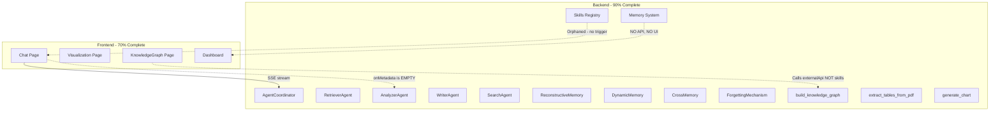
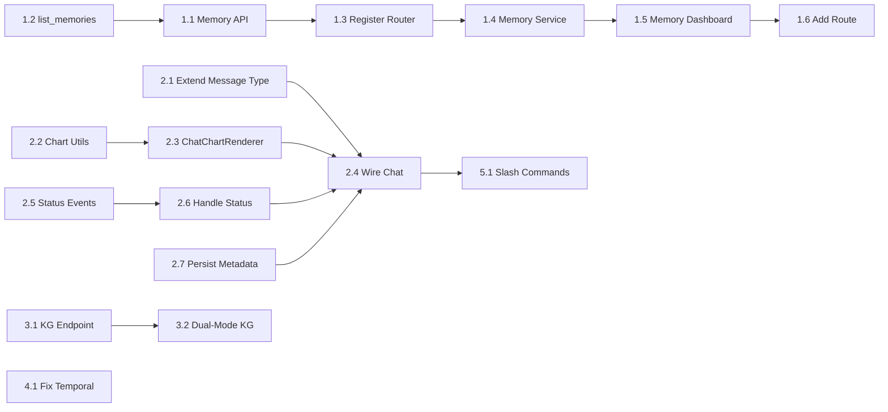

# Comprehensive System Integration Plan

## Current State Analysis

The project has a powerful backend with 4 major disconnection points preventing it from functioning as a unified system:




The dashed lines represent the 4 major disconnections. Below is the plan to bridge each one.

---

## Phase 1: Memory System API + Dashboard (Core Innovation Visibility)

**Why first**: This is the academic core of the project. The reconstructive memory, forgetting mechanism, and cross-agent memory are the key differentiators. Without visibility, they might as well not exist.

### 1.1 Backend: Create Memory API

**Create** [backend/app/api/v1/memory.py](backend/app/api/v1/memory.py)

Endpoints:

- `GET /memory/stats` - Aggregate stats from `dynamic_memory_engine.get_stats()`, `forgetting_mechanism`, and `cross_memory_network.get_network_stats()`
- `GET /memory/list?project_id=&type=&agent=&page=&page_size=` - Paginated memory listing via Milvus query
- `GET /memory/{id}` - Single memory detail via `dynamic_memory_engine.get_memory_by_id()`
- `DELETE /memory/{id}` - Manual memory deletion
- `POST /memory/reconstruct` - **Critical**: Run the full Trace -> Expand -> Reconstruct pipeline and return **each step's intermediate output** (cue, trace seeds, expanded set, final reconstruction, timing)
- `GET /memory/decay-preview?project_id=` - Run `forgetting_mechanism.get_decay_preview()` on recent memories
- `GET /memory/cross-network` - Return `cross_memory_network.get_network_stats()`

### 1.2 Backend: Add `list_memories` to DynamicMemoryEngine

**Modify** [backend/app/rag/memory_engine/dynamic_memory.py](backend/app/rag/memory_engine/dynamic_memory.py)

Add a new method `list_memories(project_id, memory_type, agent_source, offset, limit)` using `self.milvus.query()` with filter expressions and pagination support, instead of the search-based `retrieve()`.

### 1.3 Backend: Register Memory Router

**Modify** [backend/app/api/v1/**init**.py](backend/app/api/v1/__init__.py) - Add `memory.router` with prefix `/memory`

### 1.4 Frontend: Memory Service

**Create** [frontend/src/services/memory.ts](frontend/src/services/memory.ts) - API client matching all `/memory/*` endpoints

### 1.5 Frontend: Memory Dashboard Component

**Create** a Memory Dashboard as a new tab inside the Project Detail page at [frontend/src/pages/Project/Detail/index.tsx](frontend/src/pages/Project/Detail/index.tsx)

Dashboard tabs:

- **Overview**: Stat cards (total memories, by type breakdown, by agent source breakdown, active/protected/decaying counts)
- **Memory List**: Sortable table with columns: content preview, type, agent source, importance, access count, timestamp, protection status. Support delete action.
- **Reconstructive Demo**: An input box where you type a cue query, click "Reconstruct", and see a **step-by-step visualization**: Cue Extraction -> Trace Results -> Temporal Expansion -> Final Reconstruction, each step shown as a card with timing
- **Forgetting Preview**: Table showing each memory's current importance vs decayed importance, with color coding (green=protected, yellow=decaying, red=to-forget). Include a "Run Cleanup" button.
- **Cross-Agent Network**: Use a simple ECharts graph showing agent nodes and edge weights (shared memory counts)

### 1.6 Frontend: Add Route/Navigation

**Modify** [frontend/src/pages/Project/Detail/index.tsx](frontend/src/pages/Project/Detail/index.tsx) - Add "Memory System" tab to the existing Tabs component

---

## Phase 2: Chat-Agent Deep Integration (Metadata Rendering)

**Why**: The chat is the primary interaction surface. If it can't render charts, KG graphs, and tables, 60% of the backend's capabilities are invisible.

### 2.1 Frontend: Extend Message Type

**Modify** [frontend/src/types/models.ts](frontend/src/types/models.ts)

```typescript
export interface Message {
    role: 'user' | 'assistant';
    content: string;
    created_at: string;
    references?: Reference[];
    metadata?: Record<string, any>;  // agent metadata (charts, KG, tables)
    agent_type?: string;             // which agent handled this
}
```

### 2.2 Frontend: Extract Shared Chart Utils

**Create** [frontend/src/utils/chartOptions.ts](frontend/src/utils/chartOptions.ts)

Extract the chart option builders (wordcloud, bar, timeline, pie) from [frontend/src/pages/Project/Visualization/index.tsx](frontend/src/pages/Project/Visualization/index.tsx) into reusable functions. This avoids duplicating chart logic.

### 2.3 Frontend: Create ChatChartRenderer Component

**Create** [frontend/src/components/ChatChartRenderer/index.tsx](frontend/src/components/ChatChartRenderer/index.tsx)

A component that takes `metadata: Record<string, any>` and renders:

- **Chart data** (`metadata.data.keywords/timeline/hotspots`): Render inline ECharts using the shared chart utils
- **Knowledge graph data** (`metadata.data.knowledge_graph`): Render a mini G6 graph
- **Table data** (`metadata.data.tables`): Render an Ant Design `Table`
- **Chart images** (`metadata.chart_images`): Render base64 images directly

### 2.4 Frontend: Wire Chat Page

**Modify** [frontend/src/pages/Chat/index.tsx](frontend/src/pages/Chat/index.tsx)

Key changes:

- Store metadata per message: when `onMetadata` fires, attach it to the current assistant message
- In the `renderItem` for assistant messages, after `ReactMarkdown`, conditionally render `<ChatChartRenderer metadata={msg.metadata} />`
- Add `onStatus` handler to show intermediate agent processing stages

### 2.5 Backend: Add Status Events to SSE Stream

**Modify** [backend/app/api/v1/agents.py](backend/app/api/v1/agents.py)

In the `generate()` function, add `status` events before the non-retriever agent execution block:

```python
# Before agent execution
yield f"data: {json.dumps({'type': 'status', 'data': {'stage': 'processing', 'message': f'{agent_labels[agent_type_used]}正在处理...'}})}\n\n"

# After agent returns, before fake streaming
yield f"data: {json.dumps({'type': 'status', 'data': {'stage': 'generating', 'message': '正在生成回复...'}})}\n\n"
```

### 2.6 Frontend: Handle Status Events

**Modify** [frontend/src/services/agents.ts](frontend/src/services/agents.ts) - Add `onStatus` to `AgentStreamCallbacks`

**Modify** [frontend/src/pages/Chat/index.tsx](frontend/src/pages/Chat/index.tsx) - Show status messages as animated indicators during agent processing

### 2.7 Backend: Persist Metadata in Conversations

**Modify** [backend/app/api/v1/agents.py](backend/app/api/v1/agents.py) - When saving conversation, include `metadata` and `agent_type` in the assistant message dict:

```python
messages=[
    {"role": "user", "content": request.query},
    {"role": "assistant", "content": full_answer,
     "agent_type": agent_type_used,
     "metadata": metadata_extra}
]
```

---

## Phase 3: Knowledge Graph Unification

**Why**: The frontend KG page shows citation networks but the backend's `build_knowledge_graph` skill extracts entities/relations from paper content. These are fundamentally different features presented under the same name.

### 3.1 Backend: Add Project KG Endpoint

**Modify** [backend/app/api/v1/agents.py](backend/app/api/v1/agents.py)

Add a new endpoint:

```python
@router.post("/knowledge-graph")
async def build_project_kg(project_id: int, ...):
    # 1. Fetch paper texts from MongoDB for this project
    # 2. Concatenate/summarize key content
    # 3. Call build_knowledge_graph skill
    # 4. Return {nodes, edges} in G6-compatible format
```

### 3.2 Frontend: Dual-Mode KG Page

**Modify** [frontend/src/pages/Project/KnowledgeGraph/index.tsx](frontend/src/pages/Project/KnowledgeGraph/index.tsx)

Add a `Segmented` toggle at the top:

- **Citation Network** (existing behavior): `externalApi.getCitations()`
- **Content Knowledge Graph** (new): call the new `/agent/knowledge-graph` endpoint

In Content KG mode:

- Node colors represent entity types (Concept, Method, Dataset, etc.)
- Edge labels show relationship types (is_a, uses, improves, etc.)
- Auto-load using project papers instead of requiring a search query

---

## Phase 4: Temporal Expansion Fix (Academic Rigor)

**Why**: The current `_find_temporal_neighbors` uses `seed.content[:100]` for re-retrieval, which is semantically redundant, not temporal. For a research publication, this must be correct.

### 4.1 Modify Reconstructive Memory

**Modify** [backend/app/rag/memory_engine/reconstructive.py](backend/app/rag/memory_engine/reconstructive.py)

Replace the `_find_temporal_neighbors` method:

```python
async def _find_temporal_neighbors(self, seed, project_id, exclude_ids):
    if not hasattr(self.memory_engine, 'milvus') or not self.memory_engine.milvus:
        return []
    
    t_min = seed.timestamp - self.TEMPORAL_WINDOW
    t_max = seed.timestamp + self.TEMPORAL_WINDOW
    
    filter_expr = f"timestamp >= {t_min} && timestamp <= {t_max}"
    if project_id:
        filter_expr += f" && project_id == {project_id}"
    
    results = self.memory_engine.milvus.query(
        collection_name=self.memory_engine.COLLECTION_NAME,
        filter=filter_expr,
        output_fields=["id", "content", "timestamp", "importance", 
                       "access_count", "memory_type", "agent_source", "project_id"],
        limit=self.MAX_EXPAND_RESULTS + len(exclude_ids)
    )
    
    return [MemoryNode(...) for r in results if r["id"] not in exclude_ids]
```

---

## Phase 5: Skill Integration in Chat (Orphan Rescue)

### 5.1 Frontend: Add Prompt Hints

**Modify** [frontend/src/pages/Chat/index.tsx](frontend/src/pages/Chat/index.tsx)

Add slash-command suggestions that appear when user types `/`:

- `/analyze keywords` -> sets agent_type to analyzer_agent
- `/extract table` -> sets agent_type to analyzer_agent with hint
- `/build kg` -> triggers knowledge graph building
- `/write outline` -> sets agent_type to writer_agent

Implementation: When input starts with `/`, show an autocomplete dropdown. On selection, modify the AgentRequest to include `agent_type` and relevant `params`.

---

## Dependency Graph




## Summary of Files

**New files (5)**:

- `backend/app/api/v1/memory.py`
- `frontend/src/services/memory.ts`
- `frontend/src/components/ChatChartRenderer/index.tsx`
- `frontend/src/utils/chartOptions.ts`
- `frontend/src/pages/Project/MemoryDashboard/index.tsx`

**Modified files (10)**:

- `backend/app/api/v1/__init__.py`
- `backend/app/api/v1/agents.py`
- `backend/app/rag/memory_engine/dynamic_memory.py`
- `backend/app/rag/memory_engine/reconstructive.py`
- `frontend/src/App.tsx`
- `frontend/src/types/models.ts`
- `frontend/src/services/agents.ts`
- `frontend/src/pages/Chat/index.tsx`
- `frontend/src/pages/Project/Detail/index.tsx`
- `frontend/src/pages/Project/KnowledgeGraph/index.tsx`

