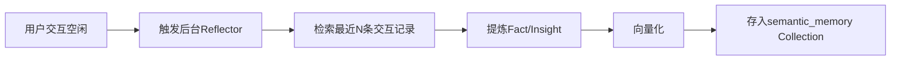
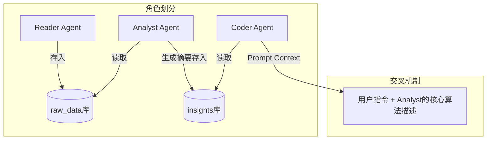
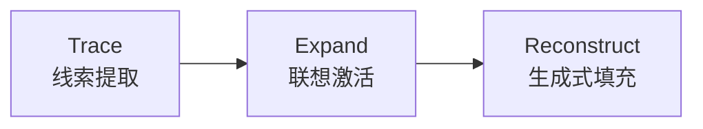
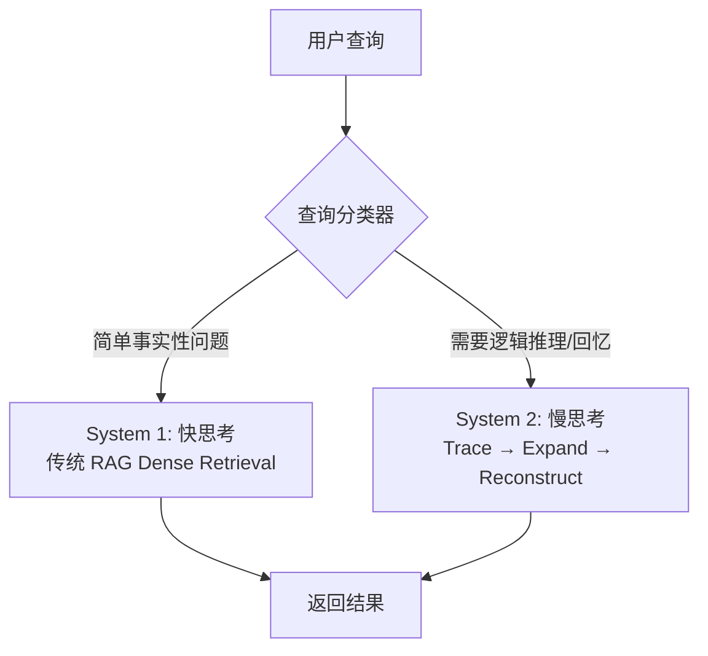
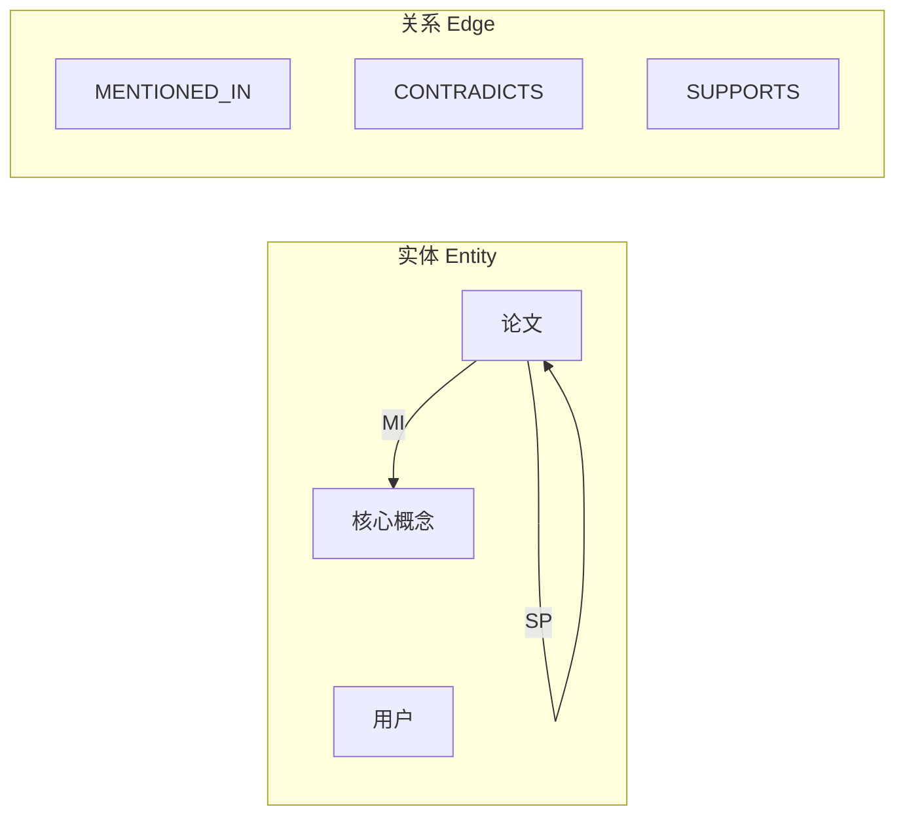
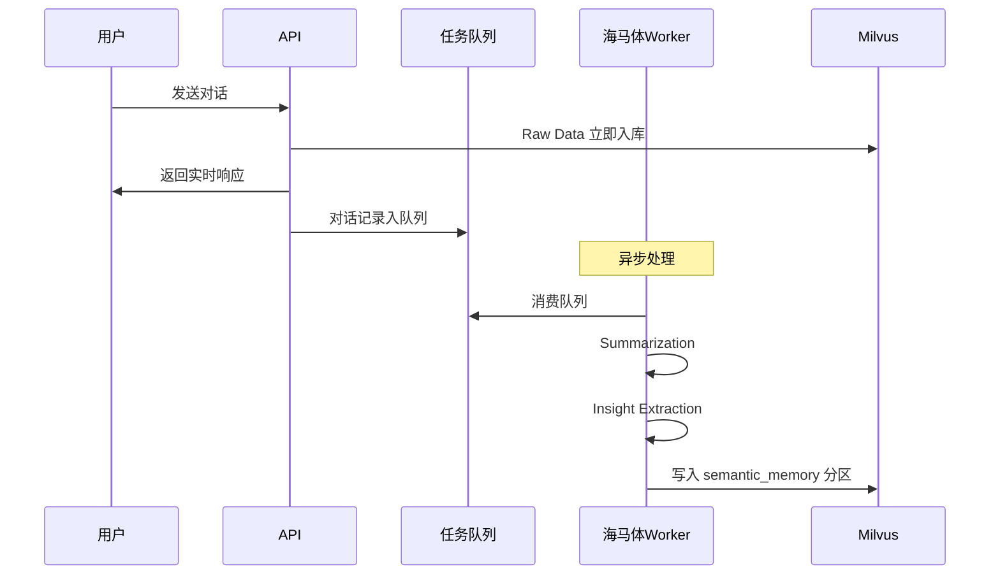
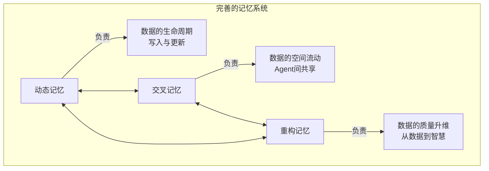
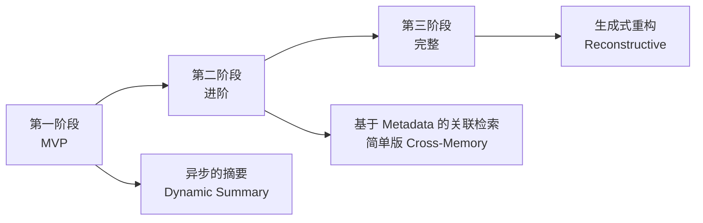

# Agent记忆系统深度研究与设计方案

> **日期**：2026年2月5日  
> **基于项目**：Graduation_design (RAG架构)  
> **研究重点**：交叉记忆、动态记忆、重构性（生成式）记忆

---

## 1. 核心概念与现状研究

### 1.1 记忆重构与生成式记忆 (Reconstructive/Generative Memory)

**核心理论**：人类记忆并非像硬盘一样"存取"数据，而是一个**重构**的过程。我们记住的是关键线索（Cues），回忆时通过逻辑填充细节。

#### 学术现状
斯坦福大学与Google合作的《*Generative Agents: Interactive Simulacra of Human Behavior*》是此领域的奠基之作。该研究提出了**"记忆流（Memory Stream）"+"反思（Reflection）"机制**：
- Agent不仅存储原始对话
- 还会定期"睡眠"（后台处理）
- 将零散的短期记忆"重构"为高级的语义观点（Insights）并存回记忆库

#### 技术实现
| 机制 | 描述 |
|------|------|
| **关联激活** | 基于 Recency（新近度）、Importance（重要性）、Relevance（相关性）三个维度计算分数 |
| **记忆合成** | 利用LLM将检索到的多个片段合成为新的"记忆节点" |

---

### 1.2 交叉记忆与多智能体协作 (Cross-Memory in Multi-Agent)

**核心理论**：在多Agent系统中，打破"信息孤岛"，构建共享的"集体潜意识"。

#### 动态共享机制
Agent A（如：文献分析员）的输出直接成为Agent B（如：代码生成员）的长期记忆。

#### 方案优势
通过交叉记忆（Cross-Memory），让 Analysis Agent 的输出直接成为 Coder Agent 的输入。这种**"流水线式的记忆传递"**比传统的 Prompt 拼接更高效，且具备持久性。如果 Coder Agent 失败了，它可以通过查询 Analysis Agent 的历史记忆来**自我修正**，而不需要重新运行 Analysis Agent。

#### 技术实现
| 方案 | 描述 |
|------|------|
| **Shared Global Scratchpad** | 所有Agent可读写的全局黑板 |
| **Federated Vector Stores** | 联邦向量库，不同Agent有不同的读写权限（Private vs Shared scopes） |

---

### 1.3 动态记忆 (Dynamic Memory)

**核心理论**：记忆不是静态的知识库，而是随时间演化、遗忘和更新的系统。

#### 技术实现
引入**"记忆生命周期管理"**：
- 不仅是RAG的"增删改查"
- 还包括记忆的**衰减（Decay）**和**整合（Consolidation）**

---

## 2. 可行性分析：基于当前RAG架构

当前架构（**LayoutLMv3 + BGE-M3 + Milvus + Hybrid Search**）是一个非常坚实的静态知识库基础。在此之上引入高级记忆模式**完全可行**，且无需推翻现有架构。

### 2.1 方案一：引入"海马体"机制（实现重构记忆）

**当前痛点**：标准RAG只能检索"原文档片段"，无法回答"这几篇论文的共同缺陷是什么"这种需要综合（重构）的问题。

#### 改造方案



1. **新增后台进程（Reflector）**：在用户交互空闲时触发
2. **重构逻辑**：检索 → 提炼 → 向量化 → 存储
3. **效果**：系统不仅检索原始PDF，还检索"之前的思考结论"

---

### 2.2 方案二：构建多Agent交叉记忆网络

**当前设计**：`docs/design/rag_flow_design.md` 中主要是单线流程。

#### 改造方案



| Agent | 职责 |
|-------|------|
| **Reader Agent** | 负责读PDF，存入 `raw_data` 库 |
| **Analyst Agent** | 负责读取 `raw_data`，生成摘要，存入 `insights` 库 |
| **Coder Agent** | 负责读取 `insights`，生成代码 |

---

## 3. 创新模型：基于线索的重构记忆系统

> **Cue-Based Reconstructive Memory**  
> 针对"模仿人脑根据线索重构记忆"的核心创新点

### 核心流程：Trace → Expand → Reconstruct



### 3.1 Trace（线索提取）

当用户输入模糊指令（如"上次那个关于Transformer变体的想法"）时：
- LLM首先**不直接回答**
- 提取**结构化线索**而非简单关键词

#### 线索提取 Prompt 设计

> [!WARNING]
> 在 `cue_extractor.py` 中，Prompt 的设计需要非常小心。不要只让 LLM 提取关键词，而是提取**"查询意图 + 关键实体 + 时间范围"**。

**❌ Bad（简单关键词）：**
```json
["Transformer", "想法"]
```

**✅ Good（结构化意图）：**
```json
{
    "topic": "Transformer variants",
    "intent": "recall_opinion",
    "time_frame": "last_month",
    "entities": ["Transformer", "attention mechanism"],
    "context_hints": ["之前讨论过", "变体"]
}
```

#### 完整 Prompt 模板

```python
CUE_EXTRACTION_PROMPT = """
你是一个记忆检索助手。分析用户的查询，提取结构化的检索线索。

用户查询: {user_query}

请输出 JSON 格式的结构化线索:
{
    "topic": "核心讨论主题",
    "intent": "查询意图类型 (recall_fact/recall_opinion/summarize/compare)",
    "time_frame": "时间范围 (today/this_week/last_month/all_time)",
    "entities": ["关键实体列表"],
    "context_hints": ["上下文提示词"]
}
"""
```

### 3.2 Expand（联想激活）

使用Cues在向量库中检索。

> [!IMPORTANT]
> **关键创新**：不只检索相似度高的（Dense Retrieval），引入**时序关联**。检索该记忆发生时间点**前后**的事件，即使它们语义不相似（模仿人脑的情景记忆）。

**方案优势**："基于线索的时序关联"是对生物大脑海马体功能的精彩模仿。这允许 Agent 即使在很久之后，也能通过一个微小的线索（Cue）"回想"起当时的完整场景，而不仅仅是匹配关键词。

### 3.3 Reconstruct（生成式填充）

将检索到的碎片（Fragments）喂给LLM。

**Prompt指令**：
> "根据这些零散的片段，还原当时的完整对话场景和逻辑结论。"

✅ 这解决了RAG中**"碎片化信息丢失上下文"**的问题。

---

## 4. 潜在风险与缺点分析

> [!CAUTION]
> 在实施前必须充分评估以下风险

### 4.1 延迟与性能瓶颈（⚠️ High-Risk）

| 问题 | 影响 |
|------|------|
| Trace → Expand → Reconstruct 流程中，Reconstruct 需要调用 LLM 进行生成 | 如果在用户每一次提问时都实时进行这个流程，响应时间会显著增加（**可能增加 3-5 秒**） |
| **风险** | 对于实时交互系统，这种延迟可能是不可接受的 |

### 4.2 "虚假记忆"与幻觉（Hallucination）

| 问题 | 影响 |
|------|------|
| 重构记忆的核心是"生成式填充" | 如果 LLM 根据错误的线索进行了错误的联想，它会自信地**"捏造"一段从未发生过的记忆** |
| **风险** | 在严肃的学术或科研场景中是**致命的**。系统可能会"记错"文献的结论 |

### 4.3 记忆噪音与检索精度

| 问题 | 影响 |
|------|------|
| 方案中的"检索该记忆发生时间点前后的事件"假设了**时间相邻=逻辑相关** | 如果用户在同一时间段内快速切换了话题，单纯基于时间的检索会引入大量**噪音** |
| **例子** | 先问了 Transformer，突然插入一句关于午饭的闲聊，又回到 RAG |

### 4.4 向量数据库的膨胀

| 问题 | 影响 |
|------|------|
| 所有的"反思"、"摘要"、"交互"都存入向量库 | Milvus 的索引构建压力和存储成本会随时间**呈指数级增长** |

---

## 5. 改进方向与实施建议

> [!TIP]
> 为规避上述风险并提升系统鲁棒性，建议加入以下优化

### 5.1 架构优化：引入"快慢思考"机制（System 1 & System 2）

**核心思想**：不要对所有查询都使用完整的"重构流程"。



| 模式 | 适用场景 | 示例 |
|------|----------|------|
| **快思考 (System 1)** | 简单的事实性问题 | "BERT的作者是谁？" |
| **慢思考 (System 2)** | 需要逻辑推理或回忆的问题 | "总结我们上次关于...的讨论" |

#### 实施提示

> [!NOTE]
> `query_classifier.py` 的准确性至关重要。初期可以使用**简单的规则匹配**（如关键词检测）或**轻量级模型**（如 BERT-Tiny），避免在这个分流环节消耗太多时间。

```python
# query_classifier.py 示例实现

RECALL_KEYWORDS = ["上次", "之前", "记得", "讨论过", "总结", "回顾"]
REASONING_KEYWORDS = ["为什么", "如何", "比较", "区别", "联系"]

def classify_query(query: str) -> str:
    """快速分类查询类型"""
    query_lower = query.lower()
    
    # 检测是否需要回忆/推理
    if any(kw in query for kw in RECALL_KEYWORDS + REASONING_KEYWORDS):
        return "system_2"  # 慢思考
    
    return "system_1"  # 快思考（默认）
```

---

### 5.2 记忆分层与图谱化（Graph Memory）

**问题**：向量数据库（Milvus）擅长相似度匹配，但不擅长结构化关系。

#### 改进方案

引入轻量级的**知识图谱（Knowledge Graph）**概念：



- 在 Milvus 的 `metadata` 中存储 `related_ids` 或 `concept_tags`
- **价值**：当进行"线索提取"时，不仅靠向量距离，还可以沿着图谱的边游走，获取更精准的上下文

#### Milvus Schema 设计建议

> [!TIP]
> 用 metadata 模拟轻量级图谱非常聪明，避免了引入繁重的 Neo4j 等图数据库。

在 Milvus 的 Schema 设计中，增加一个 **JSON 类型**的字段 `relations`：

```python
# Milvus Collection Schema
fields = [
    FieldSchema(name="id", dtype=DataType.VARCHAR, is_primary=True, max_length=64),
    FieldSchema(name="content", dtype=DataType.VARCHAR, max_length=65535),
    FieldSchema(name="embedding", dtype=DataType.FLOAT_VECTOR, dim=1024),  # BGE-M3
    FieldSchema(name="timestamp", dtype=DataType.INT64),
    FieldSchema(name="importance", dtype=DataType.FLOAT),
    FieldSchema(name="type", dtype=DataType.VARCHAR, max_length=32),  # 'raw', 'reflection', 'summary'
    FieldSchema(name="relations", dtype=DataType.JSON),  # 关系图谱
]

# relations 字段示例
{
    "related_ids": ["mem_001", "mem_002"],
    "type": "supports",
    "concept_tags": ["transformer", "attention", "nlp"]
}
```

---

### 5.3 异步反思与"睡眠机制"的工程落地

**问题**：不要在用户等待回复时进行"反思（Reflection）"。

#### 改进方案



**效果**：用户体验是实时的，而记忆的"智慧"会随时间异步增长。

#### 实施提示

> [!NOTE]
> 毕设初期建议先用简单的后台线程或协程，避免引入过重的中间件。

| 场景 | 推荐方案 |
|------|----------|
| **单机应用（MVP）** | `asyncio.Queue` 或后台线程 |
| **分布式应用** | Celery + Redis/RabbitMQ |
| **Docker 环境** | 可考虑引入 Redis 作为消息队列 |

```python
# 简单的异步队列实现 (单机版)
import asyncio
from typing import Dict

class AsyncMemoryQueue:
    def __init__(self):
        self.queue = asyncio.Queue()
    
    async def enqueue(self, memory_data: Dict):
        """将记忆数据入队"""
        await self.queue.put(memory_data)
    
    async def worker(self):
        """后台 Worker（海马体进程）"""
        while True:
            memory_data = await self.queue.get()
            await self._process_memory(memory_data)
            self.queue.task_done()
    
    async def _process_memory(self, data: Dict):
        """处理记忆：摘要 + 提取洞察"""
        # 1. Summarization
        # 2. Insight Extraction
        # 3. 写入 semantic_memory
        pass
```

---

### 5.4 增加"遗忘机制"（Forgetting Mechanism）

**目的**：防止数据库膨胀和噪音干扰。

#### 衰减函数

```
Score = Similarity × w1 + Recency × w2 + AccessCount × w3
```

| 参数 | 描述 |
|------|------|
| `Similarity` | 语义相似度 |
| `Recency` | 新近度（时间衰减） |
| `AccessCount` | 访问次数权重 |

#### 冷启动问题与"保护期"机制

> [!WARNING]
> **问题**：刚开始运行时，所有记忆的 `AccessCount` 都是 0。如果不小心，可能会误删刚存入的重要信息。

**解决方案**：引入**"保护期"机制**

```python
# forgetting.py

from datetime import datetime, timedelta

PROTECTION_PERIOD = timedelta(hours=24)  # 24小时保护期

def should_forget(memory: MemoryNode, current_time: datetime) -> bool:
    """判断是否应该遗忘该记忆"""
    
    # 新记忆享有"免死金牌"，不参与衰减计算
    memory_age = current_time - memory.timestamp
    if memory_age < PROTECTION_PERIOD:
        return False  # 保护期内，不遗忘
    
    # 计算衰减分数
    score = calculate_decay_score(memory)
    
    # 低于阈值则归档或删除
    return score < FORGET_THRESHOLD
```

| 规则 | 描述 |
|------|------|
| **保护期** | 任何新生成的记忆在 T 时间内（如 24 小时）享有"免死金牌" |
| **衰减计算** | 仅对超过保护期的记忆进行衰减评分 |
| **执行策略** | 低分记忆定期**归档**（移出热数据区）或**删除** |

---

## 6. 关键技术注意事项

### 6.1 向量维度统一

> [!CAUTION]
> **重要**：确保所有存入 Milvus 的向量都**统一使用同一模型**进行 Embedding，否则无法在同一个空间内计算相似度。

当前架构使用了：
- **LayoutLMv3**：文档处理（PDF 版面分析）
- **BGE-M3**：向量检索

| 数据类型 | Embedding 模型 | 说明 |
|----------|----------------|------|
| PDF 切片 | **BGE-M3** | LayoutLMv3 仅用于版面分析，最终文本仍需 BGE-M3 编码 |
| 对话记录 | **BGE-M3** | 保持一致 |
| 反思总结 | **BGE-M3** | 保持一致 |
| Agent 输出 | **BGE-M3** | 保持一致 |

```python
# 统一的 Embedding 接口
from sentence_transformers import SentenceTransformer

class UnifiedEmbedder:
    def __init__(self):
        self.model = SentenceTransformer('BAAI/bge-m3')
    
    def embed(self, text: str) -> List[float]:
        """统一的向量化接口"""
        return self.model.encode(text).tolist()
```

---

## 7. 三种记忆模式的协作关系



| 记忆类型 | 核心职责 |
|----------|----------|
| **动态记忆** | 负责数据的生命周期（写入与更新） |
| **交叉记忆** | 负责数据的空间流动（Agent间共享） |
| **重构记忆** | 负责数据的质量升维（从数据到智慧） |

---

## 8. 代码实现：类接口设计

建议在 `backend/app/rag/memory_engine/` 下实现。

### 8.1 基础类定义

```python
# backend/app/rag/memory_engine/base.py

from abc import ABC, abstractmethod
from typing import List, Dict, Optional
from datetime import datetime

class MemoryNode:
    """记忆单元实体"""
    def __init__(self, content: str, embedding: List[float], metadata: Dict):
        self.id: str = metadata.get('id')
        self.content = content
        self.embedding = embedding
        self.timestamp: datetime = metadata.get('timestamp', datetime.now())
        self.importance: float = metadata.get('importance', 1.0)  # 重要性权重
        self.type: str = metadata.get('type')  # 'raw', 'reflection', 'summary'
        self.access_count: int = metadata.get('access_count', 0)
        self.relations: Dict = metadata.get('relations', {})  # 图谱关系

class BaseMemoryEngine(ABC):

    @abstractmethod
    async def add_memory(self, content: str, metadata: Dict) -> str:
        """写入记忆 (System 1 快速写入)
        
        Returns:
            memory_id: 新创建的记忆ID
        """
        pass

    @abstractmethod
    async def retrieve(
        self, 
        query: str, 
        structured_cues: Optional[Dict] = None,
        top_k: int = 10
    ) -> List[MemoryNode]:
        """检索记忆 (支持结构化 Cue 扩展)
        
        Args:
            query: 原始查询
            structured_cues: 结构化线索 {"topic", "intent", "time_frame", "entities"}
            top_k: 返回数量
        """
        pass

    @abstractmethod
    async def consolidate(self):
        """整合记忆 (System 2 慢速后台处理 - 对应'睡眠'机制)"""
        pass
    
    @abstractmethod
    async def forget(self, threshold: float = 0.3):
        """遗忘机制 - 清理低价值记忆
        
        Args:
            threshold: 衰减阈值，低于此值的记忆将被归档/删除
        """
        pass
```

---

## 9. 分阶段实施计划

> [!IMPORTANT]
> **核心原则**："克制" — 不要试图在 MVP 阶段实现完美的人脑模拟



### 第一阶段：MVP - 实现异步动态摘要

```
每次对话结束后：
  ↓
Raw Data 立即入库（实时）
  ↓
后台 Worker 异步总结即时对话
  ↓
作为一条新的"记忆"存入 Milvus semantic_memory
  ↓
下次对话优先检索这些"总结"
```

### 第二阶段：进阶 - 基于 Metadata 的关联检索

在RAG检索环节，加入**"相关性扩展"**：
- 检索到A文档时
- 通过 `related_ids` 自动把**关联文档摘要**也带出来
- 交给LLM重组信息

### 第三阶段：完整 - 实现生成式重构

完整实现 Trace → Expand → Reconstruct 流程，配合 System 1 & System 2 分流机制。

---

## 10. 下一步行动计划

> [!TIP]
> 这份文档现在已经足以作为毕业论文的**核心章节（第三章：系统设计）**的底稿。

### 建议的"第一行代码"

| 步骤 | 任务 | 文件位置 |
|------|------|----------|
| **1** | 定义数据结构 | `backend/app/models/memory.py` |
| **2** | 设置 Milvus Collections | `raw_interactions` + `semantic_memory` |
| **3** | 编写 MVP 逻辑 | `dynamic_memory.py` 中的 `add_memory` 方法 |

---

## 11. 创新价值

> [!TIP]
> 这个方向非常适合作为毕业设计的创新点：
> - ✅ **理论深度**：认知科学
> - ✅ **工程落地价值**：解决RAG上下文丢失问题

**这个循序渐进的过程本身就是一篇完美的毕业论文章节安排。**

---

## 附录：模块目录结构建议

```
backend/app/rag/
├── memory_engine/
│   ├── __init__.py
│   ├── base.py                # 基础类定义 (MemoryNode, BaseMemoryEngine)
│   ├── dynamic_memory.py      # 动态记忆管理
│   ├── cross_memory.py        # 交叉记忆网络
│   ├── reconstructive.py      # 重构记忆系统
│   ├── reflector.py           # 后台反思进程（海马体Worker）
│   ├── cue_extractor.py       # 线索提取器（结构化意图）
│   ├── query_classifier.py    # 查询分类器（System 1/2 分流）
│   ├── forgetting.py          # 遗忘机制（含保护期）
│   └── embedder.py            # 统一向量化接口 (BGE-M3)
└── ...
```
