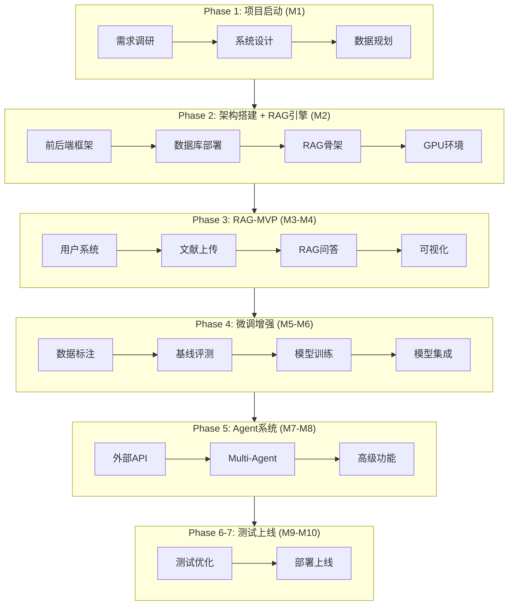

# 开发流程图 - 角色分工协作视图

> **项目周期**: 10个月 (M1-M10)  
> **团队规模**: 10人

---

## 整体流程概览



---

## 详细角色分工

### Phase 1: 项目启动与需求分析 (M1)

```
Week 1-2: 团队组建与调研
┌─────────────────────────────────────────────────────────────────┐
│                                                                   │
│   PM ────────────► 团队组建 + 项目章程 + 资源协调                │
│     │                                                             │
│     ▼                                                             │
│   PD ────────────► 用户调研 + 需求访谈 + PRD撰写                 │
│     │                                                             │
│     ▼                                                             │
│   AI工程师 ──────► 数据规划 + GPU资源申请 + 模型调研             │
│                                                                   │
└─────────────────────────────────────────────────────────────────┘

Week 3-4: 系统设计
┌─────────────────────────────────────────────────────────────────┐
│                                                                   │
│   后端Lead ─────► 数据库Schema + API设计                         │
│     │                                                             │
│     ▼                                                             │
│   前端Lead ─────► 信息架构 + 高保真原型 (Figma)                  │
│     │                                                             │
│     ▼                                                             │
│   PD ───────────► 原型评审 + 需求确认                            │
│                                                                   │
└─────────────────────────────────────────────────────────────────┘
```

| 角色 | 具体任务 | 产出物 |
|-----|---------|-------|
| PM | 团队组建、章程制定、资源协调 | 项目章程、分工表 |
| PD | 用户调研(50人)、PRD撰写 | PRD文档、原型 |
| 后端Lead | 数据库设计、API设计 | Schema、API文档 |
| 前端Lead | 信息架构、原型设计 | Figma原型 |
| AI工程师 | 数据规划、GPU申请 | 数据规划表 |

---

### Phase 2: 架构搭建 + RAG引擎 (M2)

```
Week 5-6: 框架搭建
┌─────────────────────────────────────────────────────────────────┐
│                                                                   │
│   前端x2 ────────► React项目 + 组件库 + 路由                     │
│     ║                                                             │
│     ║ (并行)                                                      │
│     ║                                                             │
│   后端x2 ────────► FastAPI框架 + SQLAlchemy + Celery            │
│                                                                   │
└─────────────────────────────────────────────────────────────────┘

Week 7-8: 数据库 + RAG骨架
┌─────────────────────────────────────────────────────────────────┐
│                                                                   │
│   后端Lead ─────► Docker部署 (PG/Mongo/Redis/Milvus/ES)         │
│     │                                                             │
│     ▼                                                             │
│   AI Lead ──────► RAG引擎骨架 (LangChain + BGE-M3)              │
│     │                                                             │
│     ▼                                                             │
│   AI工程师 ─────► GPU环境配置 + 模型下载                         │
│                                                                   │
└─────────────────────────────────────────────────────────────────┘
```

| 角色 | 具体任务 | 产出物 |
|-----|---------|-------|
| 前端x2 | React框架、组件库、路由 | 前端骨架项目 |
| 后端x2 | FastAPI框架、数据库部署 | 后端骨架、Docker配置 |
| AI Lead | RAG引擎骨架实现 | RAGEngine类 |
| AI工程师 | GPU环境、模型下载 | 环境配置文档 |
| PM | 进度监控、资源协调 | 周报 |

---

### Phase 3: RAG-MVP开发 (M3-M4)

```
Week 9-12: 用户系统 + 文献管理
┌─────────────────────────────────────────────────────────────────┐
│                                                                   │
│   后端工程师 ───► 用户API (注册/登录/JWT)                        │
│     ║                                                             │
│     ║ (并行)                                                      │
│     ║                                                             │
│   前端工程师 ───► 登录页面 + 文献列表页                          │
│     ║                                                             │
│     ║ (并行)                                                      │
│     ║                                                             │
│   AI Lead ──────► PDF解析 (LayoutLMv3 + LLM整合)                │
│                                                                   │
└─────────────────────────────────────────────────────────────────┘

Week 13-16: RAG问答 + 可视化 ⭐核心
┌─────────────────────────────────────────────────────────────────┐
│                                                                   │
│   后端Lead ─────► RAG问答API (/rag/ask, /rag/stream)            │
│     │                                                             │
│     ▼                                                             │
│   前端Lead ─────► 对话组件 (ChatWindow + 引用展示)              │
│     │                                                             │
│     ▼                                                             │
│   前端工程师 ───► 可视化 (词云 + 趋势图 + 知识图谱)              │
│     │                                                             │
│     ▼                                                             │
│   测试工程师 ───► MVP功能测试 + RAG评估框架                      │
│     │                                                             │
│     ▼                                                             │
│   PD ───────────► MVP验收                                        │
│                                                                   │
└─────────────────────────────────────────────────────────────────┘
```

| 角色 | 具体任务 | 产出物 |
|-----|---------|-------|
| 后端Lead | RAG问答API、流式输出 | /api/v1/rag/* |
| 后端工程师 | 用户系统、文献CRUD | /api/v1/users/*, papers/* |
| 前端Lead | RAG对话组件、引用卡片 | ChatWindow组件 |
| 前端工程师 | 登录页、可视化图表 | 页面+图表组件 |
| AI Lead | PDF解析、向量索引 | PDFParser类 |
| 测试工程师 | 功能测试、RAG评估 | 测试报告 |
| PD | MVP验收 | 验收报告 |

---

### Phase 4: 数据标注 + 微调增强 (M5-M6)

```
Week 17-18: 数据收集与标注
┌─────────────────────────────────────────────────────────────────┐
│                                                                   │
│   AI工程师 ─────► arXiv数据下载 + Label Studio标注              │
│     │                                                             │
│     ▼                                                             │
│   AI Lead ──────► 基线评测 (BGE-M3 Recall@10)                   │
│     │                                                             │
│     ├──► Recall>85% ──► 跳过BGE微调                             │
│     │                                                             │
│     └──► Recall<85% ──► 启动BGE微调                             │
│                                                                   │
└─────────────────────────────────────────────────────────────────┘

Week 19-22: 模型训练与集成
┌─────────────────────────────────────────────────────────────────┐
│                                                                   │
│   AI Lead ──────► LayoutLMv3微调 (布局分析)                     │
│     ║                                                             │
│     ║ (并行)                                                      │
│     ║                                                             │
│   AI工程师 ─────► BERT NER微调 (关键词提取)                     │
│     │                                                             │
│     ▼                                                             │
│   后端Lead ─────► 微调模型API集成 (ModelRouter)                 │
│     │                                                             │
│     ▼                                                             │
│   测试工程师 ───► 模型评估 (F1, Recall)                          │
│                                                                   │
└─────────────────────────────────────────────────────────────────┘
```

| 角色 | 具体任务 | 产出物 |
|-----|---------|-------|
| AI Lead | 基线评测、LayoutLMv3训练 | 评测报告、模型 |
| AI工程师 | 数据标注、BERT训练 | 标注数据、模型 |
| 后端Lead | 模型路由集成 | ModelRouter类 |
| 测试工程师 | 模型评估 | 评估报告 |
| PM | GPU资源协调 | - |

---

### Phase 5: Agent系统 + 高级功能 (M7-M8)

```
Week 23-28: 外部API + Agent
┌─────────────────────────────────────────────────────────────────┐
│                                                                   │
│   后端Lead ─────► 外部API集成 (Semantic Scholar, OpenAlex)      │
│     │                                                             │
│     ▼                                                             │
│   AI Lead ──────► Multi-Agent系统 (Retriever/Analyzer/Writer)   │
│     │                                                             │
│     ▼                                                             │
│   后端工程师 ───► Agent API封装 (/agents/review, /agents/trend) │
│     │                                                             │
│     ▼                                                             │
│   前端Lead ─────► Agent界面 (进度展示 + 综述预览)               │
│     │                                                             │
│     ▼                                                             │
│   前端工程师 ───► 高级功能页面 (趋势分析 + 写作辅助)            │
│                                                                   │
└─────────────────────────────────────────────────────────────────┘
```

| 角色 | 具体任务 | 产出物 |
|-----|---------|-------|
| AI Lead | Multi-Agent设计与实现 | AgentCoordinator |
| 后端Lead | 外部API集成 | SemanticScholarClient |
| 后端工程师 | Agent API封装 | /api/v1/agents/* |
| 前端Lead | Agent交互界面 | AgentProgressView |
| 前端工程师 | 高级功能页面 | 趋势分析页 |
| 测试工程师 | Agent功能测试 | 测试用例 |

---

### Phase 6-7: 测试与上线 (M9-M10)

```
Week 29-36: 测试优化
┌─────────────────────────────────────────────────────────────────┐
│                                                                   │
│   测试工程师 ───► 功能测试 + 性能测试 + 压力测试                │
│     │                                                             │
│     ▼                                                             │
│   前端x2 ────────► Bug修复 + 性能优化                            │
│     ║                                                             │
│     ║ (并行)                                                      │
│     ║                                                             │
│   后端x2 ────────► Bug修复 + 缓存优化                            │
│     ║                                                             │
│     ║ (并行)                                                      │
│     ║                                                             │
│   AI工程师 ─────► 模型量化 + 推理优化                            │
│                                                                   │
└─────────────────────────────────────────────────────────────────┘

Week 37-40: 部署上线
┌─────────────────────────────────────────────────────────────────┐
│                                                                   │
│   后端Lead ─────► 生产环境部署 (K8s/Docker)                     │
│     │                                                             │
│     ▼                                                             │
│   PM ───────────► 上线协调 + 监控配置                            │
│     │                                                             │
│     ▼                                                             │
│   PD ───────────► UAT测试 + 用户手册                             │
│     │                                                             │
│     ▼                                                             │
│   全员 ─────────► 正式上线 🎉                                    │
│                                                                   │
└─────────────────────────────────────────────────────────────────┘
```

| 角色 | 具体任务 | 产出物 |
|-----|---------|-------|
| 测试工程师 | 全量测试、性能测试 | 测试报告 |
| 前端x2 | Bug修复、性能优化 | 优化后代码 |
| 后端x2 | Bug修复、部署配置 | 生产环境 |
| AI工程师 | 模型量化 | INT8模型 |
| PM | 上线协调、监控 | 运维文档 |
| PD | UAT、用户手册 | 帮助文档 |

---

## 角色任务矩阵汇总

| 阶段 | PM | PD | 前端Lead | 前端工程师 | 后端Lead | 后端工程师 | AI Lead | AI工程师 | 测试 |
|-----|----|----|---------|-----------|---------|-----------|---------|---------|------|
| **M1** | ★ | ★ | ○ | - | ○ | - | ○ | ○ | - |
| **M2** | ○ | - | ★ | ★ | ★ | ★ | ★ | ★ | - |
| **M3-M4** | ○ | ○ | ★ | ★ | ★ | ★ | ★ | ○ | ★ |
| **M5-M6** | ○ | - | - | - | ○ | - | ★ | ★ | ○ |
| **M7-M8** | ○ | - | ★ | ★ | ★ | ★ | ★ | ○ | ○ |
| **M9-M10** | ★ | ★ | ○ | ○ | ★ | ○ | ○ | ○ | ★ |

**图例**: ★ 主要负责 | ○ 参与 | - 无任务

---

*流程图版本: v2.0*  
*更新日期: 2026年1月*
