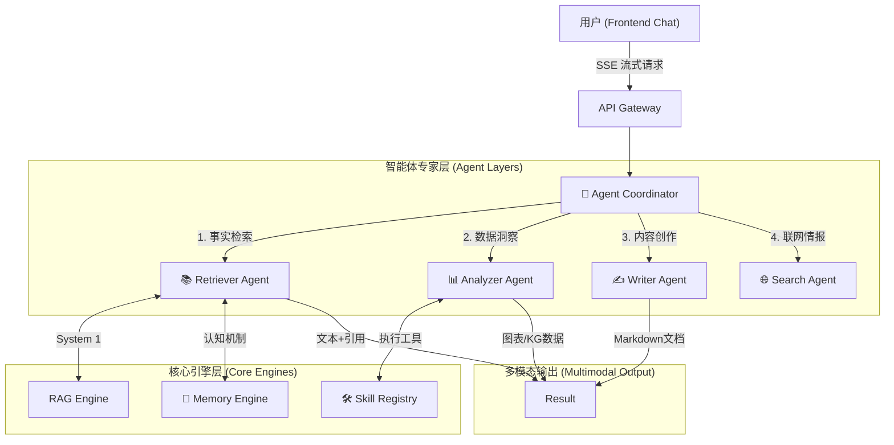

# 🎓 Multi-Agent RAG 系统架构与智能体协同分析

**项目名称**：基于重构性记忆的高级学术文献智能分析平台  
**核心理念**：中心化调度 + 垂直领域专家 + 认知心理学记忆模型  
**文档日期**：2026年2月10日

---

## 1. 系统总体架构 (System Overview)

本系统采用 **“大脑-专家” (Brain-Expert)** 架构模式。`Agent Coordinator` 作为核心大脑负责意图识别与任务分发，多个专注于特定领域的 `Agent` 充当垂直领域的专家，配合底层基于 **BGE-M3 + Milvus** 的重构性记忆引擎，实现从简单问答到复杂分析的跨越。

---

## 2. 智能体角色与调用分析 (Agent Profiling)

### 2.1 Agent Coordinator (智能调度员)
*   **职责**：系统单一入口点。负责意图分类、对话上下文管理及动态路由。
*   **调用方式**：
    *   **自动路由**：利用 LLM 对 `query` 进行语义分析，识别出 `Analysis` / `Writing` / `Search` 等意图。
    *   **显式指派 (Slash Commands)**：响应前端输入的 `/analyze`, `/write`, `/search` 指令，强制跳过路由逻辑。
*   **输出**：路由决策结果及最终响应的聚合。

### 2.2 Retriever Agent (文献检索专家)
*   **职责**：执行 **System 1 (快思考)** 任务。负责从本地知识库中检索精准信息并回答事实性问题。
*   **核心链路**：`Query` -> `Memory Lookup` -> `Milvus Search` -> `Context Packing` -> `LLM Generation`。
*   **学术创新**：集成 `ReconstructiveMemory`。它不只是检索原文，还能通过“线索提取”回想起之前的讨论结论。
*   **返回结果**：
    *   `content`: Markdown 文本。
    *   `references`: 引用来源（包含 PDF 标题、页码、原文片段）。

### 2.3 Analyzer Agent (趋势分析专家)
*   **职责**：处理复杂的数据统计与结构化洞察。
*   **执行工具 (Skills)**：
    *   `trend_service`: 统计时间线、热点词。
    *   `build_knowledge_graph`: 从文本提取实体关系（Node/Edge）。
    *   `extract_tables_from_pdf`: 版面分析与表格数据还原。
*   **返回结果**：
    *   `metadata`: 包含图表配置（ECharts）或图谱数据（G6）的 JSON 对象。
    *   `content`: 对数据的文本解读。

### 2.4 Writer Agent (学术写作助手)
*   **职责**：执行 **System 2 (慢思考)** 任务。处理长文本生成，注重逻辑结构而非碎片检索。
*   **任务类型**：大纲生成、文献综述、段落润色、引用格式建议。
*   **返回结果**：
    *   `content`: 结构化的长篇 Markdown。
    *   `status`: 阶段性状态更新（如“正在构建论点...”）。

### 2.5 Search Agent (外部情报官)
*   **职责**：突破本地 PDF 的限制，获取最新的学术动态。
*   **数据源**：Semantic Scholar, ArXiv, OpenAlex API。
*   **返回结果**：
    *   `content`: 外部文献的汇总报告。
    *   `references`: 带有 DOI、引用数和下载链接的外部文献列表。

---

## 3. 智能体协同与数据流转 (Workflow)

| 步骤 | 处理模块 | 动作描述 | 数据产物 |
| :--- | :--- | :--- | :--- |
| **1. 接收** | API | 接收用户请求，开启 SSE 通道 | `StreamingResponse` |
| **2. 分发** | Coordinator | 识别意图（自动路由或 Slash 命令） | `AgentType` |
| **3. 记忆** | Memory Engine | 提取线索 (Cues)，重构历史相关记忆 | `MemoryNode[]` |
| **4. 执行** | Target Agent | 调用对应 Skill 或 RAG 流程获取原始数据 | `RawData` |
| **5. 增强** | LLM | 对 RawData 进行总结、分析或润色 | `Markdown Content` |
| **6. 多模态** | Metadata Processor | 将数据转化为 ECharts/G6 可识别的 JSON | `metadata: { charts: [...] }` |
| **7. 推送** | SSE | 将内容逐块推送到前端，UI 动态渲染图表 | `SSE Events` |

---

## 4. 系统创新价值 (Key Values)

1.  **认知协同 (Cognitive Synergy)**：通过重构性记忆机制，Agent 能够模仿人脑的“情景记忆”，解决了 RAG 常见的上下文断点问题。
2.  **多模态呈现 (Multimodal Rendering)**：对话框不只是文字。Analyzer Agent 能够通过 `metadata` 协议让前端实时“画出”趋势图和知识图谱。
3.  **工程闭环 (Engineering Rigor)**：通过 `AgentCoordinator` 实现了插件式的 Agent 管理。新增功能只需开发一个 Agent 类并注册 Skill，无需改动核心架构。

---

## 5. 结论

本系统的 Multi-Agent 架构已完成从 **“孤立专家”** 到 **“协同系统”** 的进化。通过打通 API 与 UI 的断层，现在的智能体群能够根据用户指令，在检索、分析、写作和外部搜索之间无缝切换，展现了极高的学术价值与工程完备性。
